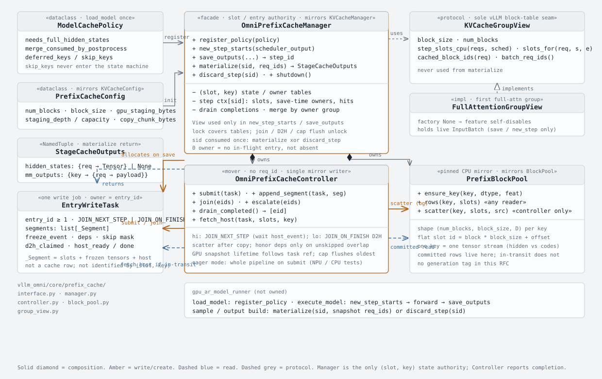
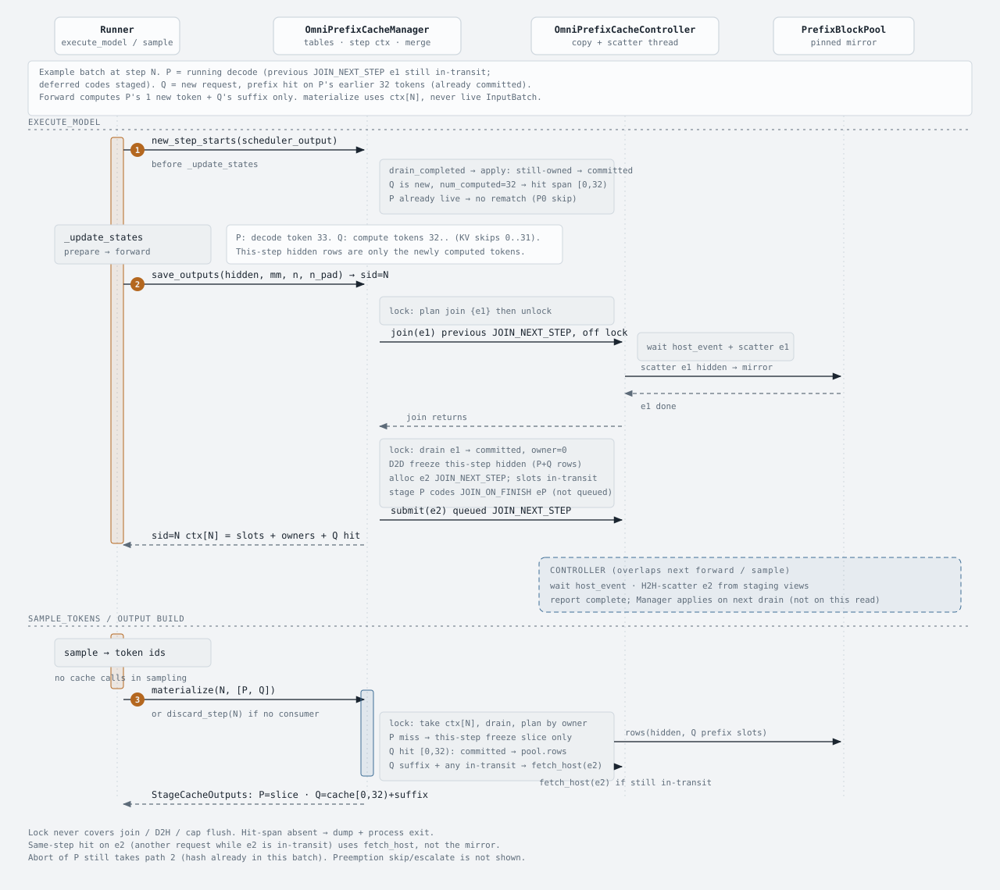

# Omni Prefix Cache Runtime

## Table of Contents

1. [Overview](#overview)
2. [Architecture](#architecture)
3. [Write paths](#write-paths)
4. [Read path](#read-path)
5. [Runner contract](#runner-contract)
6. [Invariants](#invariants)
7. [Compatibility](#compatibility)
8. [Related files](#related-files)

The conceptual block/slot model and a walkthrough live in
[Automatic Prefix Caching in Omni Models](prefix_caching.md). This page is the
implementation contract for `vllm_omni/core/prefix_cache/`.

## Overview

Omni prefix cache mirrors vLLM KV block/slot mapping and keeps stage outputs
(hidden states and per-token multimodal tensors) on CPU, so a prefix hit skips
both KV recompute and inter-stage tensor recompute.

`OmniPrefixCacheManager` owns `(slot, key)` occupancy, hit spans, and merge.
`OmniPrefixCacheController` owns the staging pool, copy queues, and scatter
into `PrefixBlockPool`. The state lock covers those tables only — never a
join, a cap flush, or a copy.

Miss is not an error: a request in this step's snapshot with no hit span gets
this step's forward slice only. A hit span that resolves to absent slots is
fatal (`OmniPrefixCacheUnmatchError`). Abort still writes: once a hash entered
this step's batch it must land in the cache.

## Architecture

| This package | vLLM counterpart |
|---|---|
| `OmniPrefixCacheManager` | `KVCacheManager` |
| `OmniPrefixCacheController` | none (closest: connector worker side) |
| `PrefixBlockPool` | `BlockPool` |
| `StagingBufferPool` | none |
| `KVCacheGroupView` / `FullAttentionGroupView` | `KVCacheGroupSpec` / `FullAttentionSpec` |
| `PrefixCacheConfig` | `KVCacheConfig` |

```
vllm_omni/core/prefix_cache/
├── interface.py      # PrefixCacheConfig / ModelCachePolicy / StageCacheOutputs
├── manager.py        # OmniPrefixCacheManager
├── controller.py     # OmniPrefixCacheController + StagingBufferPool
├── block_pool.py     # PrefixBlockPool
└── group_view.py     # KVCacheGroupView / factory
```



Two host stores:

- **`StagingBufferPool`**: reusable step-sized pages. `save_outputs` launches
  one whole-step D2H here for immediately-cached keys. Per-req `seg.host` is a
  view into that page, not a second copy.
- **`PrefixBlockPool`**: durable `(kv_slot, key)` prefix cache. The committer
  only scatters into it.

`KVCacheGroupView` is the only path into the vLLM block table, and only from
`new_step_starts` / `save_outputs`. `materialize` uses the save-time snapshot
and never reads the live `input_batch`.

## Write paths

Schedule is a key split, not a token-count split.

| Schedule | Keys | D2H | Join |
|---|---|---|---|
| `JOIN_NEXT_STEP` | hidden + non-deferred mm | launched at save into staging; committer waits `host_event` then H2H-scatters | next `save_outputs` (`host_ready` only) |
| `JOIN_ON_FINISH` | `deferred_keys` | committer copies the GPU freeze | finish/abort escalate, then the next save; cap may flush earlier |

Staging-page holders (`for_step` / `for_task` / `for_reader`) share one slot.
The page is free only when none remain. `for_step` is released after
`materialize` clones (or `discard_step`); `for_task` is released when the
manager drains a completed scatter.

`host_event` is record-once, wait-many. `materialize`, the committer, and
`fetch_host` all wait it before touching a staging view. There is no
per-task `publish_host` on the step path.

## Read path

A hit span is grouped by the save-time `tid` of each `(slot, key)`:

- **committed** → `PrefixBlockPool`
- **in-transit `JOIN_NEXT_STEP`** → wait `host_event`, slice the staging view
- **in-transit `JOIN_ON_FINISH`** → freeze + committer/sync D2H
- **absent** inside a hit span → fail-fast

This step's rows for the next stage come from `materialize` cloning the
staging views after the event wait. Prefetch during `new_step_starts` overlaps
the forward; `materialize` writes only the tail.



## Runner contract

```python
cache.register_policy(ModelCachePolicy.from_model(model))   # load_model

cache.new_step_starts(scheduler_output)   # before _update_states
# ...forward...
sid = cache.save_outputs(hidden, mm_flat,
                         num_tokens_unpadded=n, num_tokens_padded=n_pad)
outs = cache.materialize(sid, req_ids)    # or discard_step(sid)
```

`save_outputs` must not hold the state lock across join, D2H, or cap flush:

```text
lock → list tids to join → unlock
join_host_ready(previous JOIN_NEXT_STEP + escalated JOIN_ON_FINISH)
D2D freeze + stage_step_host
lock → drain → submit JOIN_NEXT_STEP (seg.host = views) + stage deferred
     → hang ctx → unlock → return sid
```

Each `sid` is consumed exactly once (`materialize` XOR `discard_step`).
`req_ids` must be a subset of the save snapshot. Warmup/dummy steps are never
fed. `materialize` may run on the async output builder while the engine is
already in the next step.

## Invariants

1. One D2D freeze at save (freeze event). Task contents are immutable; only
   the storage tier moves.
2. One committer writes the mirror. Block reuse remounts `(slot, key)` to the
   new `tid` and skip-masks the old task. Completions apply only if they still
   own the slot.
3. Reads resolve by save-time `tid` and current occupancy; they do not wait
   for the whole request to commit.
4. GPU-byte cap on deferred freeze is a degraded path (force-flush oldest).
5. The lock covers tables only. Plans hold task refs; fetch runs unlocked.
6. `new_step_starts` before `_update_states`. Each `step_id` is consumed
   exactly once after `save_outputs` (`materialize` or `discard_step`),
   possibly on the async output builder after the engine has entered the
   next step.

## Compatibility

Prefix cache and [async Omni output materialization](omni_async_output_materialization.md)
can run together. `save_outputs` returns a `step_id`; the output builder later
calls `materialize(sid, req_ids)` with the save-time request list. The engine
may already be in the next step. `_should_use_async_omni_output()` does not
disable itself when the cache is present.

## Related files

- `vllm_omni/core/prefix_cache/`
- `vllm_omni/worker/gpu_model_runner.py` (`_ensure_omni_prefix_cache`)
- `tests/core/test_prefix_cache.py`
- [Automatic Prefix Caching](prefix_caching.md)
- [Async Omni Output Materialization](omni_async_output_materialization.md)
