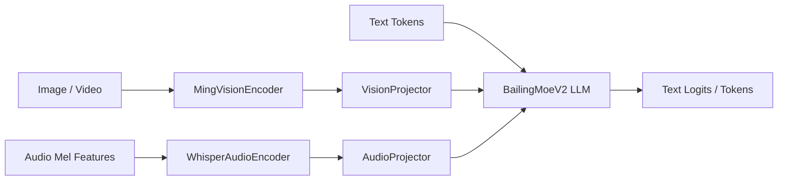

# Ming-flash-omni 在 vLLM-Omni 的架构与推理流程梳理（基于 PR #1822）

> 本文聚焦你要求的第二部分：  
> **基于上游 PR [#1822](https://github.com/vllm-project/vllm-omni/pull/1822) 梳理 Ming 的模型结构与代码细节**，并与 HF 上完整模型能力做边界对照。

---

## 1. 分析范围与代码入口

> 当前分支并未包含 Ming 实现，本文基于上游 PR 分支 `pull/1822/head` 的源码读取与对照。

核心文件：

- 统一模型入口  
  `vllm_omni/model_executor/models/ming_flash_omni/ming_flash_omni.py`
- Thinker 主体  
  `vllm_omni/model_executor/models/ming_flash_omni/ming_flash_omni_thinker.py`
- MoE LLM 主干（BailingMoeV2）  
  `vllm_omni/model_executor/models/ming_flash_omni/modeling_bailing_moe_v2.py`
- 音频编码器 / 视觉编码器 / 投影器  
  `audio_encoder.py` / `vision_encoder.py` / `projectors.py`
- 配置与 Processor  
  `vllm_omni/transformers_utils/configs/ming_flash_omni.py`  
  `vllm_omni/transformers_utils/processors/ming.py`
- Stage 配置  
  `vllm_omni/model_executor/stage_configs/bailingmm_moe_v2_lite.yaml`

---

## 2. PR #1822 的落地边界：Thinker-only

虽然 Ming 官方是 omni（感知+生成一体），但 PR #1822 在 vLLM-Omni 的实际落地范围非常明确：

- `model_stage=thinker`：已实现
- `model_stage=imagegen`：`NotImplementedError`
- `model_stage=talker`：`NotImplementedError`

因此在该 PR 中可服务能力是：

- 输入：text / image / video / audio
- 输出：text

对应 stage 配置也是单阶段 thinker（`bailingmm_moe_v2_lite.yaml`）。

---

## 3. Ming Thinker 结构：多塔编码 + MoE LLM 解码

`ming_flash_omni_thinker.py` 的核心组件：

- `language_model`: `BailingMoeV2ForCausalLM`
- `vision`: `MingVisionEncoder`
- `audio`: `WhisperAudioEncoder`
- `linear_proj` / `linear_proj_audio`: 把视觉/音频特征投影到 LLM hidden size

---

## 4. 输入处理：高层占位符到 patch token 序列

`transformers_utils/processors/ming.py` 采用高层占位符：

- `<IMAGE>`
- `<VIDEO>`
- `<AUDIO>`

并在处理阶段扩展为模型期望的 patch token 片段，例如：

- `<image><imagePatch>*N</image>`
- `<video><framePatch>*N</video>`
- `<audio><audioPatch>*N</audio>`

这与 Qwen3-Omni 的 placeholder 机制目标一致，但 token 体系与扩展规则不同。

---

## 5. 音频编码路径：Whisper packed varlen

`audio_encoder.py` 的设计重点是对多段不同长度音频做 packed 处理：

1. 每段 mel 先经 conv 下采样
2. 把各段拼成 packed 序列
3. 通过 `cu_seqlens` 在注意力中实现 varlen 计算
4. 再用 `AudioProjector` 映射到 LLM hidden

这样可以显著减少 padding 带来的空算。

---

## 6. MoE 主干：BailingMoeV2 + MultiRouter

`modeling_bailing_moe_v2.py` 中，稀疏层使用 `SharedFusedMoE`，并支持 `router_type=MultiRouter`。

核心机制：

- 三套路由门：
  - `gate`（通用）
  - `image_gate`（图像 token）
  - `audio_gate`（音频 token）
- 根据 `image_mask`/`audio_mask` 选择路由结果

这意味着同一 LLM 主干里，专家分配可按模态差异化。

---

## 7. 位置编码差异：Ming 的 video_rope

`MingVideoRopeMRotaryEmbedding` 不是标准 mrope 的连续 T/H/W 分段，而是：

- spatial 维度做 H/W 交错
- temporal 频率放在末段

这会影响：

- MRoPE 输入位置构造逻辑
- RoPE remap 实现细节

从框架角度看，这类模型要求“可插拔 RoPE remap”，不能把 3D RoPE 固化成单一模板。

---

## 8. Stage 配置视角（PR 现状）

`bailingmm_moe_v2_lite.yaml` 当前仅启用 thinker stage，并预留了 imagegen/talker 的注释块。

这和代码实现边界一致：先把多模态理解链路打通，再留出生成侧 stage 扩展口。

---

## 9. 与 HF 完整结构对照（Jonathan1909 / inclusionAI）

基于 HF `Jonathan1909/Ming-flash-omni-2.0` 的 `config.json` 与 `README.md`：

- 架构名：`BailingMM2NativeForConditionalGeneration`
- 完整能力：image/text/video/audio 输入，image/text/audio 输出
- 官方示例支持 `load_image_gen=True, load_talker=True`

对照 PR #1822：

| 能力 | HF 完整模型 | PR #1822 |
|---|---|---|
| Thinker（多模态理解->文本） | 有 | 有 |
| Image Generation | 有 | 无（占位） |
| Talker / Audio Generation | 有 | 无（占位） |
| Stage 形态 | 可多阶段 | 当前单阶段 thinker |

---

## 10. 对后续落地的工程建议

若后续继续推进 Ming：

1. 先补 `model_stage=talker` 的最小可推理版本（哪怕先不做全流式）
2. 再补 `model_stage=imagegen` 与 thinker->imagegen relay 协议
3. 在 stage_input_processor 中明确跨 stage 数据契约（字段名、生命周期、设备驻留策略）
4. 将 MultiRouter 的 mask 构造与多模态 placeholder 展开建立端到端一致性测试

---

## 11. 总结

- PR #1822 的价值非常实在：把 Ming 的 **Thinker 路径**（processor/config/audio/vision/MoE 主干）完整接到了 vLLM-Omni。
- 但它并不等于“完整 Ming-Omni 支持”：imagegen 与 talker 仍未落地 stage 执行。
- 如果以你原文的框架抽象视角看，这个 PR 处在“把 Understanding 阶段接入框架”的阶段，Speech Synthesis 与输出生成侧仍是后续工作。

