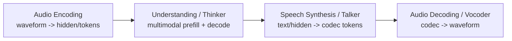
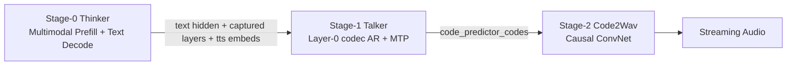
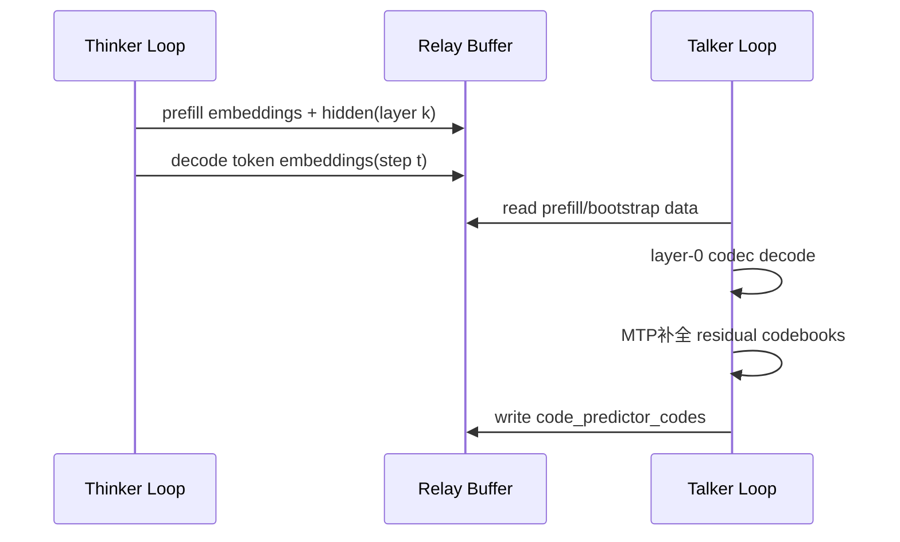
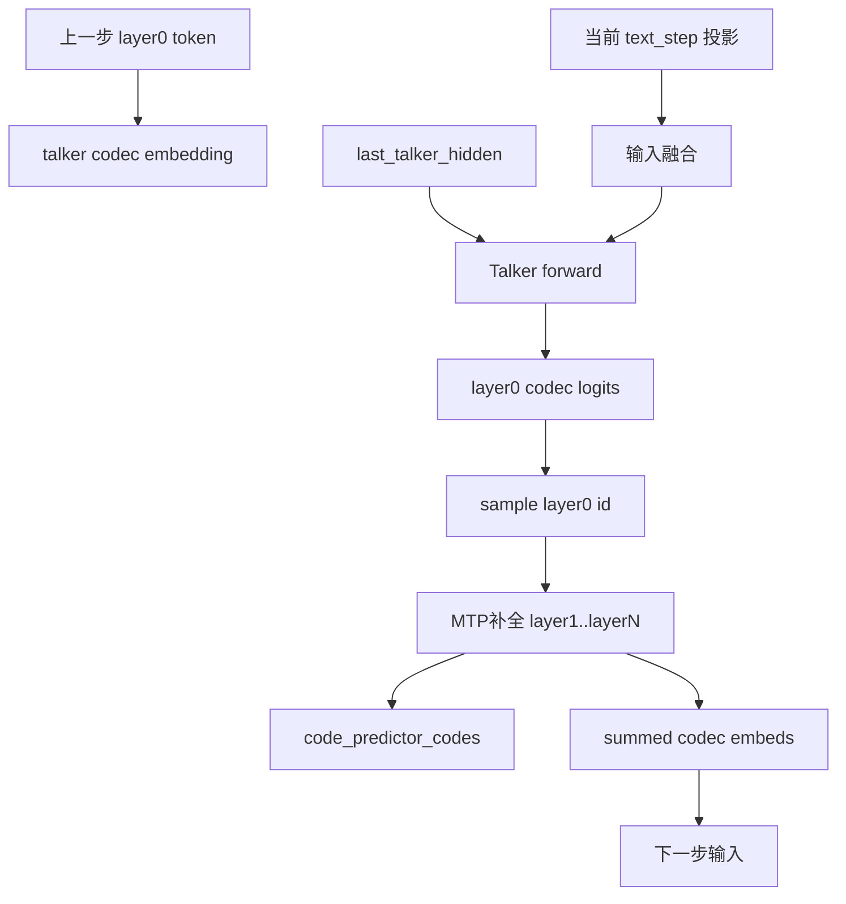
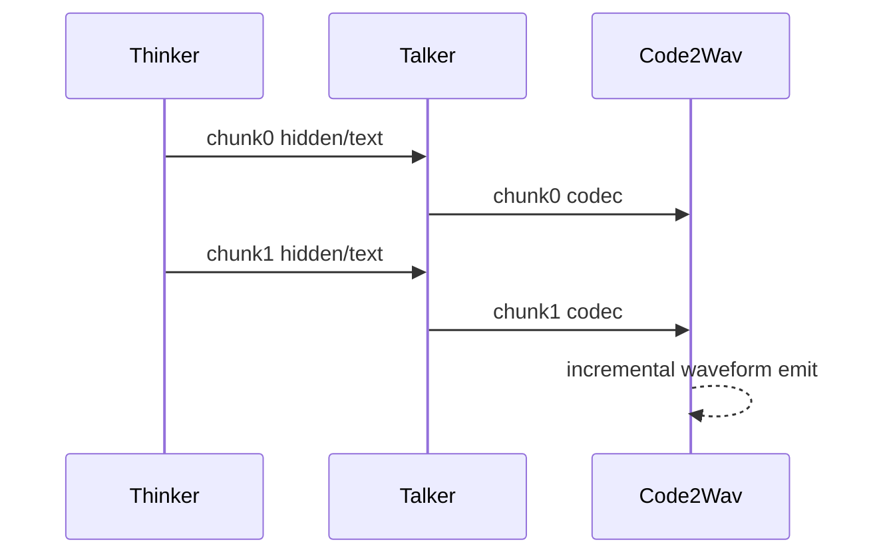

# Qwen3-Omni 在 vLLM-Omni 的模型原理与执行流程（细化版）

> 本文聚焦 **Qwen3-Omni**，按“模型原理 -> 推理执行 -> serving 抽象”展开，并对齐你给出的文章脉络（Codec/RVQ、四阶段 pipeline、Thinker-Talker 信息流与时序）。

---

## 0. 读代码入口（Qwen3-Omni）

- 统一入口（按 stage 路由）  
  `vllm_omni/model_executor/models/qwen3_omni/qwen3_omni.py`
- Thinker（多模态理解 + 文本生成）  
  `vllm_omni/model_executor/models/qwen3_omni/qwen3_omni_moe_thinker.py`
- Talker（层0 codec 自回归）  
  `vllm_omni/model_executor/models/qwen3_omni/qwen3_omni_moe_talker.py`
- MTP / Code Predictor（补全残余 codebook）  
  `vllm_omni/model_executor/models/qwen3_omni/qwen3_omni_moe_code_predictor_mtp.py`
- Code2Wav（codec -> waveform）  
  `vllm_omni/model_executor/models/qwen3_omni/qwen3_omni_code2wav.py`
- Stage 输入桥接（thinker->talker / talker->code2wav）  
  `vllm_omni/model_executor/stage_input_processors/qwen3_omni.py`
- Stage 配置  
  `vllm_omni/model_executor/stage_configs/qwen3_omni_moe*.yaml`

---

## 1. Omni 通用概念框架（Qwen3-Omni 视角）

## 1.1 四阶段 Pipeline：waveform 到 waveform

从框架实现看：

- A（编码）和 D（解码）常较稳定
- B（理解）和 C（合成）决定模型差异

---

## 1.2 Codec 与 RVQ：为什么输出侧要离散 token

原始音频采样率高，不能直接作为长序列喂 LLM。常见路径是：

1. 连续特征压缩
2. 向量量化成离散 token（VQ / RVQ）

RVQ 下一个时间步会有多个 codebook token（不是一个），自然引出：

- 先预测“关键层”（如 layer0）
- 再补全“残余层”（MTP/Fast AR）

这就是 Qwen3-Omni `Talker + MTP` 设计的理论根基。

---

## 1.3 Speech Synthesis 的四个自由度

| 维度 | 选项 A | 选项 B |
|---|---|---|
| 生成范式 | AR（逐 token） | NAR（Diffusion/Flow） |
| Codebook 策略 | 逐层补全 | 同步并行输出 |
| Thinker->Talker 信息流 | text token + hidden states | hidden only |
| 时序关系 | 串行嵌套 | 异步流水线 |

Qwen3-Omni 当前实现可归类为：

- AR
- layer0 + 残余补全
- text + hidden 的双通道
- Thinker/Talker 双 loop（async_chunk 下更明显）

---

## 2. Qwen3-Omni 三阶段结构（代码落地）

`Qwen3OmniMoeForConditionalGeneration` 通过 `model_stage` 切换三个子模型：

- thinker
- talker
- code2wav

---

## 3. Thinker：多模态理解执行流程

## 3.1 输入处理与占位符扩展

`Qwen3OmniMoeThinkerMultiModalProcessor` 负责：

- audio/image/video placeholder 扩展
- 各模态 token 数计算
- `use_audio_in_video` 的 interleaved 情况处理
- 生成 MRoPE 所需 `mm_features`

## 3.2 embedding 融合

`embed_input_ids()` 里：

1. 先做 text embedding
2. 再 merge multimodal embeddings
3. 若开启视觉 deepstack，额外准备 deepstack 输入 buffer

## 3.3 对 Talker 的输出

Thinker forward 可捕获指定层：

- layer0 embedding（text 通道）
- `accept_hidden_layer` hidden（多模态声学/视觉通道）

并在 `make_omni_output()` 附加 thinker 侧 `tts_bos/eos/pad` embedding。

---

## 4. Thinker -> Talker：信息流与桥接执行

桥接分两层：

1. stage 间拼包：`stage_input_processors/qwen3_omni.py`
2. talker 解包重构：`qwen3_omni.py` 中 `talker_preprocess_*`

核心状态：

- `last_talker_hidden`
- `trailing_text_hidden`
- `cached_thinker_decode_embeddings`

### 为什么 text token + hidden states 都需要？

对齐你文章中的观点：

- text token 提供“说什么”的离散锚点（语义一致性）
- hidden states 提供“怎么说”的连续属性（韵律、音色等）

当前代码正是这个双通道设计（`text_projection` + `hidden_projection`）。

---

## 5. Talker + MTP：逐步计算流程

`qwen3_omni_moe_talker.py`：

- Talker 主干负责 layer0 codec
- `codec_head` 输出 layer0 logits
- `code_predictor_forward()` 调 MTP 补全其余 codebook

### MTP 为什么走 re-prefill（短序列重算）？

`qwen3_omni_moe_code_predictor_mtp.py` 的设计选择：

- 每步序列长度短（`num_code_groups + 1`）
- 重算比复杂 KV 生命周期管理更稳
- 内联 top-k/top-p sampling 减少 op 开销

---

## 6. Code2Wav：流式解码路径

`qwen3_omni_code2wav.py`：

- `chunked_decode()`：同步 chunk + 左上下文
- `chunked_decode_streaming()`：按请求携带 left_context_size

这使得 codec 帧一到位就能增量合成波形。

> 代码细节：当前输入重排按 **16 quantizers** 分组，文档/注释中“8-layer”在部分路径是历史残留。

---

## 7. sync vs async_chunk：执行时序差异

### sync

- Thinker 完成后才触发 Talker
- Talker 完成后才触发 Code2Wav

### async_chunk

- Thinker chunk 输出立即送 Talker
- Talker chunk codec 立即送 Code2Wav
- 三阶段流水并行

---

## 8. KV Cache 需求分层（Thinker/Talker/MTP）

| 模块 | 上下文增长 | 典型 cache 策略 | 说明 |
|---|---|---|---|
| Thinker | 长程增长 | paged KV | 标准 LLM decode |
| Talker | 时间轴增长 | paged KV | 独立语音 decode loop |
| MTP | 每步短序列 | 重算/短暂临时 cache | 当前实现偏 re-prefill |
| Code2Wav | 非 Transformer | 无 KV | ConvNet |

---

## 9. 与 S2 Pro（Dual-AR）的抽象对照（简版）

你贴文里强调的边界在 Qwen3 代码里是可见的：

- S2 Pro：一个外层时间循环里嵌套 fast AR（串行嵌套）
- Qwen3：Thinker / Talker 两个独立 loop（异步 relay）

因此框架抽象上：

- 可统一：LLM serving 基建、stage 编排
- 必须差异化：跨阶段信息流语义、时序与缓存策略

---

## 10. 总结

- Qwen3-Omni 在当前 vLLM-Omni 中已形成完整三阶段链路（Thinker + Talker/MTP + Code2Wav）
- 其关键不是“多一个模型”，而是 **Thinker/Talker 双循环 + 双通道信息流（text + hidden）**
- 从模型原理到执行实现，`RVQ 层级不对称 -> layer0 主干 + 残余补全` 这条逻辑在代码中是贯通的

