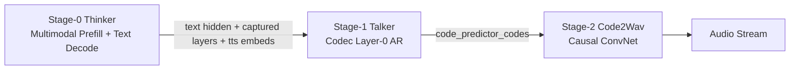
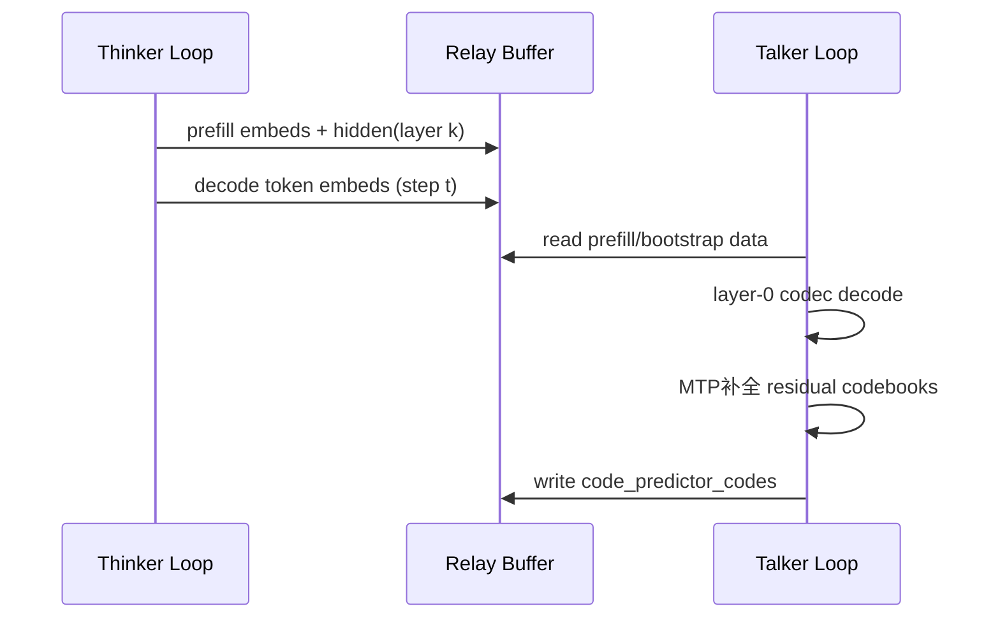
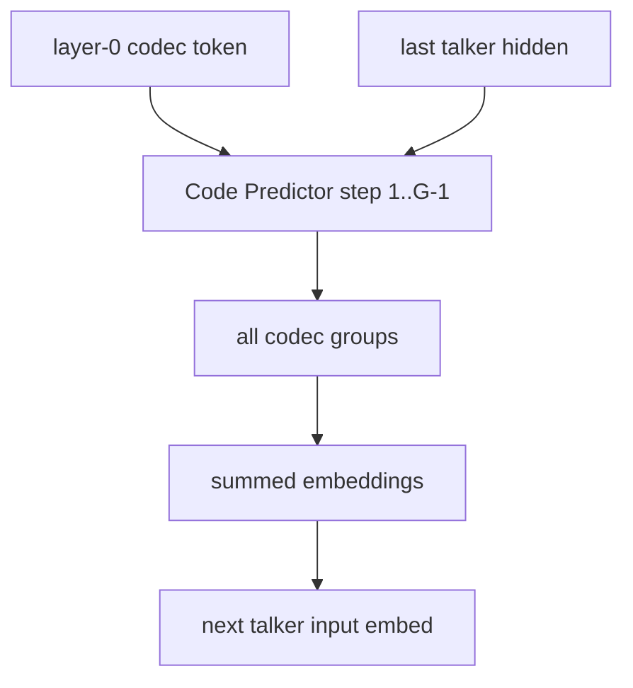
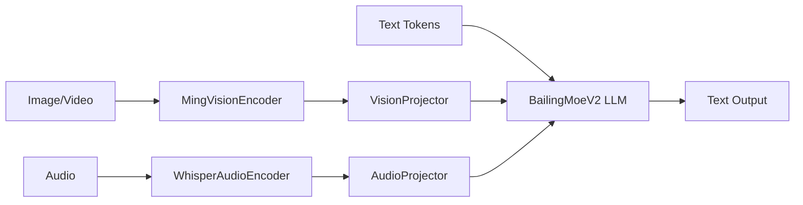

# Qwen3-Omni 与 Ming-flash-omni 在 vLLM-Omni 的架构与推理流程梳理

> 本文面向 **vllm-omni 框架实现**，重点回答两件事：
>
> 1. 当前仓库中 `Qwen3-Omni` 的模型结构、阶段拆分、推理计算流程是如何落地的？
> 2. 基于上游 PR [#1822](https://github.com/vllm-project/vllm-omni/pull/1822) 的 `Ming-flash-omni-2.0` 支持，当前落地了什么、缺了什么、与完整模型结构的差距是什么？

---

## 0. 读代码入口（索引）

### Qwen3-Omni（当前分支已有）

- 统一入口（按 stage 路由）  
  `vllm_omni/model_executor/models/qwen3_omni/qwen3_omni.py`
- Thinker（多模态理解 + 文本生成）  
  `vllm_omni/model_executor/models/qwen3_omni/qwen3_omni_moe_thinker.py`
- Talker（层0 codec 自回归）  
  `vllm_omni/model_executor/models/qwen3_omni/qwen3_omni_moe_talker.py`
- MTP / Code Predictor（补全残余 codebook）  
  `vllm_omni/model_executor/models/qwen3_omni/qwen3_omni_moe_code_predictor_mtp.py`
- Code2Wav（codec -> waveform）  
  `vllm_omni/model_executor/models/qwen3_omni/qwen3_omni_code2wav.py`
- Stage 输入拼接（thinker->talker / talker->code2wav）  
  `vllm_omni/model_executor/stage_input_processors/qwen3_omni.py`
- Stage 配置  
  `vllm_omni/model_executor/stage_configs/qwen3_omni_moe*.yaml`

### Ming-flash-omni（基于 PR #1822 分析）

> 注意：当前分支未包含 Ming 代码。以下内容基于上游 PR 分支 `pull/1822/head` 读取。

- 统一入口（stage 占位）  
  `vllm_omni/model_executor/models/ming_flash_omni/ming_flash_omni.py`
- Thinker 主体  
  `vllm_omni/model_executor/models/ming_flash_omni/ming_flash_omni_thinker.py`
- MoE LLM 主干（BailingMoeV2）  
  `vllm_omni/model_executor/models/ming_flash_omni/modeling_bailing_moe_v2.py`
- 音频编码器 / 视觉编码器 / 投影器  
  `audio_encoder.py` / `vision_encoder.py` / `projectors.py`
- 自定义配置与处理器  
  `vllm_omni/transformers_utils/configs/ming_flash_omni.py`  
  `vllm_omni/transformers_utils/processors/ming.py`
- Stage 配置  
  `vllm_omni/model_executor/stage_configs/bailingmm_moe_v2_lite.yaml`

---

## 1. Qwen3-Omni：当前 vLLM-Omni 的实现结构

## 1.1 三阶段拓扑（Thinker -> Talker -> Code2Wav）

当前实现是 **统一 model class + stage 化实例化**：

- `model_stage=thinker`：只初始化 thinker 子模型
- `model_stage=talker`：只初始化 talker 子模型，并启用 custom pre/post process
- `model_stage=code2wav`：只初始化 code2wav 子模型

其核心由 `Qwen3OmniMoeForConditionalGeneration` 完成 stage 分发。

---

## 1.2 Thinker：多模态输入对齐 + 文本解码

### (a) 输入处理与占位符扩展

`qwen3_omni_moe_thinker.py` 里，`Qwen3OmniMoeThinkerMultiModalProcessor` 负责：

- 把 audio/image/video 映射为 tokenizer 占位符 token 序列
- 计算每个模态 token 数（音频由 feature length 推导）
- 支持 `use_audio_in_video` 的 interleaved 情况
- 为 MRoPE 提供可复原的 `mm_features`

### (b) Embedding 融合

`embed_input_ids()` 逻辑：

- 先 text embedding
- 再把多模态 embedding 合并进 `is_multimodal` 位置
- 若视觉 deepstack 生效，额外写入 deepstack buffer

### (c) 输出给 Talker 的信息

Thinker forward 可开启 `capture_layer_indices=[0, accept_hidden_layer]`，并返回：

- layer0 embedding（作为 Talker 的 text 通道输入来源）
- 指定中间层 hidden（作为 Talker 的 mm 通道输入来源）
- 另外在 `make_omni_output()` 中，额外产出 `tts_bos/eos/pad` 的 thinker-side embedding

---

## 1.3 Thinker -> Talker 的桥接：stage input processor + talker preprocess

桥接分两层：

1. **Stage 间拼包**（`stage_input_processors/qwen3_omni.py`）
2. **Talker 侧解包与重构输入**（`qwen3_omni.py` 中 `talker_preprocess_*`）

核心点：

- prefill 阶段：构建 talker prompt（包含用户段、assistant bootstrap 段、speaker token）
- decode 阶段：把 thinker decode 产生的新 token embedding 按步喂给 talker
- 同时维护 `last_talker_hidden`、`trailing_text_hidden`、`cached_thinker_decode_embeddings` 等跨步缓存

这对应一个典型 **异步双循环**（尤其 async_chunk 模式）：

---

## 1.4 Talker + MTP 的计算流程（代码级）

`qwen3_omni_moe_talker.py` 中：

- Talker 主干是 MoE Transformer（codec embedding 替换文本 embedding）
- `codec_head` 只负责预测 layer-0 codec
- `code_predictor_forward()` 调用 `Qwen3OmniMoeTalkerCodePredictor`

`qwen3_omni_moe_code_predictor_mtp.py` 里的 MTP 关键实现：

- 采用 **re-prefill（短序列重算）**，不跨帧持久 KV cache
- 每步 sequence 很短（`num_code_groups + 1`），用 SDPA + inline top-k/top-p sampling
- 通过本地 `proj_buf` 聚合每层 codec embedding，避免跨请求 alias

Talker 单步可抽象为：

---

## 1.5 Code2Wav：按 chunk 的流式解码

`qwen3_omni_code2wav.py` 里实现了两条路径：

- `chunked_decode()`：同步 chunk 解码（带 left context）
- `chunked_decode_streaming()`：async-chunk 场景，按每次输入带 `left_context_size`

一个实现细节：当前 `qwen3_omni.py` 的 code2wav 输入重排按 **16** 个 quantizer 分组（`input_ids.shape[0] % 16`），因此注释里“8-layer RVQ”的表述在部分文件中是历史残留，实际代码路径是 16 组处理。

---

## 1.6 运行时拓扑配置（sync / async_chunk / multiconnector）

- 同步三阶段：`qwen3_omni_moe.yaml`
- 异步 chunk：`qwen3_omni_moe_async_chunk.yaml`
- 多连接器版本：`qwen3_omni_moe_multiconnector.yaml`

差异集中在：

- `async_chunk: true/false`
- `custom_process_next_stage_input_func` 与 connector 配置
- stage 间传输是否共享内存/外部 connector

---

## 2. Ming-flash-omni（PR #1822）代码结构梳理

## 2.1 PR 落地范围：只支持 Thinker

PR 标题与代码一致：`[Model] Add Ming-flash-omni-2.0 Thinker Stage`。

`ming_flash_omni.py` 中：

- `model_stage=thinker` 已实现
- `imagegen` / `talker` 均 `NotImplementedError`

也就是说，在 vLLM-Omni 中此 PR 的可用能力是：

- 输入：text / image / video / audio
- 输出：text

---

## 2.2 Ming Thinker 组件拆解

`ming_flash_omni_thinker.py` 的结构：

- `language_model`: `BailingMoeV2ForCausalLM`
- `vision`: `MingVisionEncoder`（封装 Qwen3 vision transformer）
- `audio`: `WhisperAudioEncoder`
- `linear_proj` / `linear_proj_audio`: 投影到 LLM hidden size

---

## 2.3 MoE 路由：MultiRouter（文本/图像/音频分路）

`modeling_bailing_moe_v2.py` 的关键点：

- 稀疏层使用 `SharedFusedMoE`
- Router 支持 `router_type=MultiRouter`
- 存在三套路由门：`gate` / `image_gate` / `audio_gate`
- forward 时根据 `image_mask`、`audio_mask` 选择对应路由结果

这和“统一 backbone + 模态特异路由”的设计一致：主干层一致，专家选择分模态。

---

## 2.4 MRoPE 变体：Ming video_rope

同文件里有 `MingVideoRopeMRotaryEmbedding`：

- 不是标准 contiguous 的 T/H/W 分段
- 对 spatial 频率做 H/W 交错映射
- temporal 频率放在末段

这也是 Ming 与 Qwen3 在位置编码实现上的一个显著差异点。

---

## 2.5 自定义 Processor / Config 适配

PR 中新增：

- `transformers_utils/configs/ming_flash_omni.py`
  - 注册 `BailingMoeV2Config` / `BailingMM2Config`
  - 适配 `AutoConfig` 与 tokenizer 映射
- `transformers_utils/processors/ming.py`
  - 统一 `<IMAGE>/<VIDEO>/<AUDIO>` 高层占位符
  - 扩展为 patch token 序列
  - 音频预处理使用 Whisper log-mel 路径

此部分是“模型可被 vLLM-Omni 正确 parse 与 token 化”的关键。

---

## 3. PR 实现 vs HF 完整模型能力对照

基于 `Jonathan1909/Ming-flash-omni-2.0`（复制于官方仓）：

- `config.json` 显示架构名为 `BailingMM2NativeForConditionalGeneration`
- README 声明完整能力是 **输入 image/text/video/audio，输出 image/text/audio**
- 示例代码中 `from_pretrained(..., load_image_gen=True, load_talker=True)`，说明原生模型含 imagegen 和 talker 路径

对照 PR #1822：

| 能力 | HF 完整模型 | PR #1822 |
|---|---|---|
| Thinker（多模态理解->文本） | 有 | 有 |
| Image Generation | 有 | 无（占位） |
| Talker / Audio Generation | 有 | 无（占位） |
| vLLM-Omni stage config | 理论可三阶段 | 当前单阶段 thinker |

---

## 4. 与 Qwen3-Omni 对比后的框架抽象边界

## 4.1 可统一的抽象

1. **Stage 编排抽象**：都可映射到 encode/understand/synthesize/decode 的 stage 概念  
2. **多模态 processor + placeholder 扩展**：都需要 placeholder->patch token 展开  
3. **LLM serving 基础设施**：Thinker 都可复用 paged KV、continuous batching、PP/TP、torch.compile

## 4.2 必须差异化的抽象

1. **Talker 形态差异**  
   - Qwen3: 已有独立 Talker + MTP + Code2Wav
   - Ming PR: 无 talker/imagegen 落地
2. **位置编码语义差异**  
   - Qwen3: 标准 mrope + interleaved audio/video 处理
   - Ming: video_rope（H/W 交错 + T 后置）
3. **MoE 路由策略差异**  
   - Ming: MultiRouter（image/audio/text 分路）是主干行为的一部分
   - Qwen3: Thinker/Talker 分体后在不同模块完成语义与语音分工

---

## 5. 工程建议（面向后续实现）

### 对 Ming（若继续落地 imagegen/talker）

1. 先补齐 stage2/3 的统一入口类（`ming_flash_omni.py`）  
2. 明确 talker 与 imagegen 的调度模型是“嵌套”还是“独立 loop”  
3. 在 stage_input_processor 中引入 thinker->talker / thinker->imagegen 的 relay 协议

### 对 Qwen3（持续优化方向）

1. 清理“8-layer vs 16-layer”注释歧义，统一文档与代码口径  
2. 把 Talker prefix cache 从 token-key 扩展到 voice/style-key（当前天然不适配 Radix token 前缀）

---

## 6. 总结

- **Qwen3-Omni 在当前 vLLM-Omni 已是完整三阶段可跑通实现**：Thinker、Talker+MTP、Code2Wav 均已落地，且支持 async_chunk。
- **Ming PR #1822 的核心贡献是 Thinker 侧接入**：完成了配置、处理器、多模态 encoder、BailingMoE 主干与 MRoPE 适配，但尚未把 imagegen/talker 接到可服务的 stage。
- 从框架抽象角度看：**“LLM serving 基础设施可统一，跨 stage 语义/声学信息流与路由机制必须模型特异化”。**

