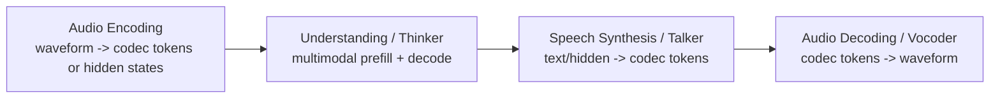
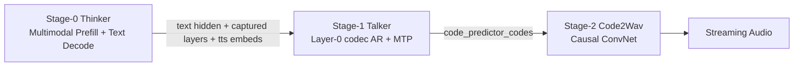
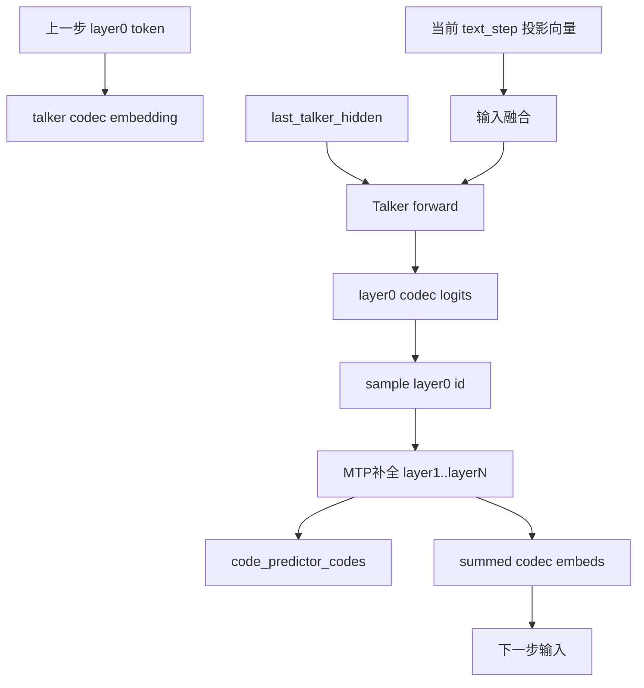
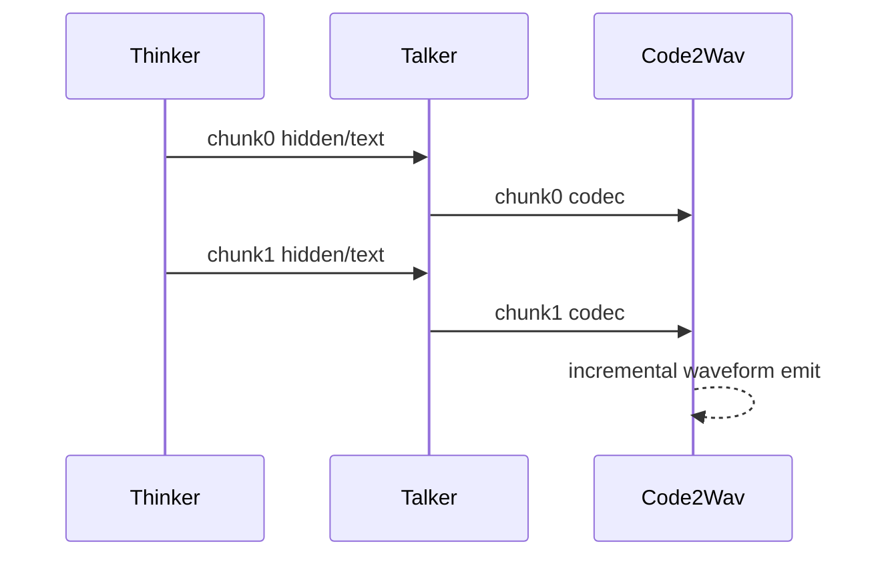
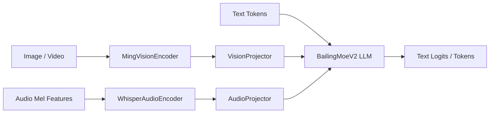

# Qwen3-Omni 与 Ming-flash-omni 在 vLLM-Omni 的架构与推理流程梳理（细化版）

> 这版按你给的文章脉络重写：先讲 **Omni 通用概念框架**（Codec / RVQ / 四阶段 / 合成设计自由度），再下钻 **Qwen3-Omni 的执行细节**，最后对照 **Ming PR #1822** 的落地边界。
>
> 目标不是只给“代码目录说明”，而是给“模型原理 -> 推理执行 -> 框架抽象”的连续视角。

---

## 0. 读代码入口（索引）

### Qwen3-Omni（当前分支已有）

- 统一入口（按 stage 路由）  
  `vllm_omni/model_executor/models/qwen3_omni/qwen3_omni.py`
- Thinker（多模态理解 + 文本生成）  
  `vllm_omni/model_executor/models/qwen3_omni/qwen3_omni_moe_thinker.py`
- Talker（层0 codec 自回归）  
  `vllm_omni/model_executor/models/qwen3_omni/qwen3_omni_moe_talker.py`
- MTP / Code Predictor（补全残余 codebook）  
  `vllm_omni/model_executor/models/qwen3_omni/qwen3_omni_moe_code_predictor_mtp.py`
- Code2Wav（codec -> waveform）  
  `vllm_omni/model_executor/models/qwen3_omni/qwen3_omni_code2wav.py`
- Stage 输入桥接（thinker->talker / talker->code2wav）  
  `vllm_omni/model_executor/stage_input_processors/qwen3_omni.py`
- Stage 配置  
  `vllm_omni/model_executor/stage_configs/qwen3_omni_moe*.yaml`

### Ming-flash-omni（基于 PR #1822 分析）

> 注意：当前分支未包含 Ming 代码。以下内容基于上游 PR 分支 `pull/1822/head` 读取。

- 统一入口（stage 占位）  
  `vllm_omni/model_executor/models/ming_flash_omni/ming_flash_omni.py`
- Thinker 主体  
  `vllm_omni/model_executor/models/ming_flash_omni/ming_flash_omni_thinker.py`
- MoE LLM 主干（BailingMoeV2）  
  `vllm_omni/model_executor/models/ming_flash_omni/modeling_bailing_moe_v2.py`
- 音频编码器 / 视觉编码器 / 投影器  
  `audio_encoder.py` / `vision_encoder.py` / `projectors.py`
- 自定义配置与处理器  
  `vllm_omni/transformers_utils/configs/ming_flash_omni.py`  
  `vllm_omni/transformers_utils/processors/ming.py`
- Stage 配置  
  `vllm_omni/model_executor/stage_configs/bailingmm_moe_v2_lite.yaml`

---

## 1. Omni 通用概念框架（对齐你文章的第一部分）

## 1.1 四阶段 Pipeline：从波形到波形

一个典型 omni 语音对话/语音输出路径可以统一成四段：

从框架层看：

- **A 与 D** 通常计算模式较稳定（编码器/卷积解码器）
- **B 与 C** 是架构差异核心（信息流耦合方式、时序、缓存策略）

---

## 1.2 Codec 与 RVQ：为什么音频最终要进离散 token 空间

原始波形（16kHz/24kHz/48kHz）时间分辨率太高，Transformer 直接吃波形序列不可行。  
因此需要先做：

1. 连续特征压缩（帧级表示）
2. 连续向量量化为离散 token（VQ / RVQ）

### 单层 VQ（直观）

- 一帧连续向量 `x` 在 codebook 中做近邻查找
- 选中条目索引 `id` 作为 token

### 多层 RVQ（实用）

- 第 0 层量化原向量，得到 `id_0`
- 第 1 层量化残差，得到 `id_1`
- ...
- 第 N-1 层量化更细残差，得到 `id_(N-1)`

于是一个时间步不是 1 个 token，而是 `N` 个 codebook token（同一帧的多层量化）。

这直接导致后续 Talker 的两种主流策略：

- 一次生成所有层（并行/块式）
- 先生成关键层（如 layer0），再补全其余层（分层）

---

## 1.3 信息层级不对称：为什么会出现 Dual-AR / MTP 这类补全器

从工程实践看，多数 codec 层承载信息并不对称：

- 前层（尤其 layer0）更偏语义/韵律骨架
- 后层更偏音色、细节、颗粒度

这意味着“主干模型 + 轻量补全器”的分工是自然的：

- 主干模型保证“说什么 + 粗粒度怎么说”
- 补全器完善“声学细节”

Qwen3-Omni 的 `Talker + MTP` 与 S2 Pro 的 `Slow AR + Fast AR` 都是这个思想在不同任务定义下的体现。

---

## 1.4 Speech Synthesis 的四个自由度（框架抽象关键）

| 维度 | 选项 A | 选项 B |
|---|---|---|
| 生成范式 | AR（逐 token） | NAR（Diffusion/Flow） |
| Codebook 策略 | 逐层/分组补全 | 同步并行输出 |
| Thinker->Talker 信息流 | text token + hidden state | hidden only |
| 时序关系 | 串行嵌套 | 异步流水线 |

Qwen3-Omni 在当前实现属于：

- AR
- layer0 + 残余补全
- text token + 选层 hidden state
- Thinker/Talker 异步（尤其 async_chunk）

---

## 1.5 Serving 视角的瓶颈分解

一个常见、且很实用的分解是：

- LLM decode（Thinker/Talker）偏 **memory-bandwidth bound**（KV cache 读写）
- Vocoder（Code2Wav/ConvNet）偏 **compute bound**

所以 stage 分离并行通常能提升资源利用率（而不只是模型逻辑清晰）。

---

## 2. Qwen3-Omni：原理到执行流程（细化）

## 2.1 当前 vLLM-Omni 的三阶段拓扑

当前实现是 **统一 model class + stage 化实例化**：

- `model_stage=thinker`：仅 thinker 子模型
- `model_stage=talker`：仅 talker 子模型，启用 custom pre/post process
- `model_stage=code2wav`：仅 code2wav 子模型

---

## 2.2 输入侧与输出侧的表征不对称（Qwen3 的一个关键特征）

Qwen3-Omni 在实现上非常明确地做了：

- **输入侧**：音/图/视频以连续 hidden 进入 Thinker（不是 RVQ 离散 token）
- **输出侧**：Talker 生成离散 codec token，再交给 Code2Wav

这在代码上对应：

- `qwen3_omni_moe_thinker.py`：多模态 processor + continuous embeddings 合并
- `qwen3_omni_moe_talker.py`：codec embedding / codec_head / code predictor

---

## 2.3 Thinker 的执行流程（prefill + decode）

### Step A: 多模态 placeholder 展开

`Qwen3OmniMoeThinkerMultiModalProcessor` 会把 `<|audio_pad|>/<|image_pad|>/<|video_pad|>` 扩展成与特征长度一致的 token 片段。

### Step B: embedding 融合

`embed_input_ids()` 先得到 text embedding，再按 `is_multimodal` 把 mm embedding merge 进去；如果 deepstack 视觉特征开启，会额外准备 deepstack buffer。

### Step C: forward 时捕获 Talker 需要的中间表示

Thinker 可按 `capture_layer_indices` 返回：

- layer 0 embedding（text 通道）
- `accept_hidden_layer` 的 hidden（mm 通道）

并在 `make_omni_output()` 额外附上 thinker-side `tts_bos/eos/pad` embedding，供 Talker 侧投影后使用。

---

## 2.4 Thinker -> Talker 信息流（为什么既要 text token 又要 hidden）

对齐你文章的论点：  
Talker 需要“说什么”与“怎么说”两个通道：

- text token / text embedding：语义锚点（内容一致性）
- mm hidden：语气、音色、韵律等连续属性

在当前代码里，这体现为：

- `text_projection`：thinker text space -> talker hidden
- `hidden_projection`：thinker mm hidden -> talker hidden
- 二者在 talker 输入侧做加和/拼接式融合（具体位置相关）

---

## 2.5 Talker 单步 decode 的计算图

在 `talker_preprocess_decode()` + `talker_mtp()` 路径下，可抽象成：

注意：MTP 在当前实现采取 re-prefill 短序列重算，而不是跨帧增长 KV cache。

---

## 2.6 MTP（Code Predictor）为什么是“短序列重算”而不是 paged KV

`qwen3_omni_moe_code_predictor_mtp.py` 的实现特点：

- 每步序列长度很小（`num_code_groups + 1`）
- 重算代价可接受，且实现更稳定
- 避免管理跨帧 KV 生命周期复杂性
- 内联 top-k/top-p 采样，减少额外 op 调度

这与“paged KV 适合长上下文、动态增长、多请求共享”的适用场景不同。

---

## 2.7 Code2Wav：流式输出与上下文裁剪

`qwen3_omni_code2wav.py` 中：

- `chunked_decode`：固定 chunk_size + left_context_size
- `chunked_decode_streaming`：由上游传入每请求 left context

语音流式输出本质是：  
每次拿到足够 codec 帧就可调用 causal ConvNet 产生增量波形。

> 实现细节：当前 `qwen3_omni.py` code2wav 输入重排按 **16 quantizers** 分组（并非所有注释里写的 8 层）。

---

## 2.8 sync 与 async_chunk 执行时序差异

### 同步模式

- Thinker 完成阶段结果后，才触发 Talker
- Talker 完成后，才触发 Code2Wav

### async_chunk 模式

- Thinker chunk 级输出到达即转发 Talker
- Talker chunk 级 codec 立刻转发 Code2Wav
- 三个 loop 可以流水并行

---

## 2.9 KV Cache 需求分层（Thinker / Talker / MTP）

| 模块 | 上下文增长 | 典型 cache 策略 | 备注 |
|---|---|---|---|
| Thinker | 长程增长 | paged KV + 连续批处理 | 标准 LLM serving |
| Talker | 按时间步增长 | paged KV | 独立 decode loop |
| MTP | 每步短序列 | 重算或短暂临时 cache | 当前实现偏 re-prefill |
| Code2Wav | 非 Transformer | 无 KV 概念 | ConvNet 逐块解码 |

---

## 3. Ming-flash-omni（PR #1822）细化分析

## 3.1 落地范围：Thinker-only（这是核心边界）

PR 标题和代码一致：`[Model] Add Ming-flash-omni-2.0 Thinker Stage`。

`ming_flash_omni.py` 中：

- `model_stage=thinker` 已实现
- `imagegen` / `talker` 为 `NotImplementedError`

即当前可服务能力是：  
**text/image/video/audio 输入 -> text 输出**

---

## 3.2 Ming Thinker 组件图与数据流

组件对应：

- `MingVisionEncoder`：封装 Qwen3 vision transformer
- `WhisperAudioEncoder`：packed varlen 注意力音频编码
- `VisionProjector` / `AudioProjector`：统一映射到 LLM hidden size
- `BailingMoeV2ForCausalLM`：多模态统一解码主干

---

## 3.3 Ming 的 Processor：高层占位符到 patch token 的映射

`processors/ming.py` 核心做法：

- 用户 prompt 用 `<IMAGE>/<VIDEO>/<AUDIO>` 作为高层占位
- 在 processor 中扩展为 `<image><imagePatch>*N</image>` 等具体 token 片段
- 音频分支走 Whisper log-mel 特征，输出 `audio_feats` 与 `encoder_feats_lengths`

这与 Qwen3 的 placeholder 机制目标一致，但 token 命名与展开规则不同。

---

## 3.4 音频编码执行细节（PR 里值得注意的工程点）

`audio_encoder.py` 使用 packed varlen 处理多段音频：

1. 每段 mel 经 conv1/conv2 下采样
2. 拼成 packed 序列
3. 用 `cu_seqlens` 在 attention 中做 varlen 计算
4. 输出再经 `AudioProjector` 映射到 LLM hidden

这种 packed 流程的好处是：

- 减少 padding 浪费
- 让多段不同长度音频共享批处理通路

---

## 3.5 BailingMoeV2 的 MultiRouter：模态感知专家路由

`modeling_bailing_moe_v2.py` 的核心差异化点：

- 稀疏层使用 `SharedFusedMoE`
- 有三套路由 gate：`gate`、`image_gate`、`audio_gate`
- 根据 token 级 `image_mask` / `audio_mask` 选择最终路由结果

可理解为：

- 文本 token 走通用路由
- 图像 patch token 与音频 patch token 可走专用路由分布

这类“模态特异路由”对统一 omni backbone 很关键。

---

## 3.6 Ming 的 MRoPE 变体：video_rope（非标准分段）

`MingVideoRopeMRotaryEmbedding` 不是普通 mrope 的 T/H/W 连续切片，而是：

- spatial 维按 H/W 交错
- temporal 维放后段

这意味着框架层如果抽象“3D RoPE”，要允许模型自定义 remap，而不是假设单一分段实现。

---

## 3.7 PR 实现 vs HF 完整能力对照

基于 `Jonathan1909/Ming-flash-omni-2.0` 的 `config.json` / `README.md`：

- 架构名：`BailingMM2NativeForConditionalGeneration`
- 完整能力：image/text/video/audio 输入，image/text/audio 输出
- 示例中显式 `load_image_gen=True, load_talker=True`

对照 PR #1822：

| 能力 | HF 完整模型 | PR #1822 |
|---|---|---|
| Thinker（多模态理解->文本） | 有 | 有 |
| Image Generation | 有 | 无（占位） |
| Talker / Audio Generation | 有 | 无（占位） |
| stage config 形态 | 可多阶段 | 当前单阶段 thinker |

---

## 4. 与你文章里的 S2 Pro / Qwen3 对比视角对齐（框架抽象边界）

虽然本文实现侧重 Qwen3 与 Ming，但从框架抽象角度，确实可借你文章的结论：

## 4.1 可以统一的能力

1. **LLM decode serving 基建**：continuous batching / paged KV / PP / TP / compile  
2. **Stage orchestration**：stage 间输入输出、connector、流式分发  
3. **后处理插件化**：code predictor / vocoder 作为 per-step callback

## 4.2 必须模型特异化的能力

1. **Talker 执行模式**
   - S2 Pro 风格：嵌套在同一步内（Dual-AR）
   - Qwen3 风格：独立 loop + relay
2. **信息流语义**
   - 是否必须 text token 作为语义锚点
   - hidden state 选层策略与模态筛选策略
3. **位置编码与路由语义**
   - Qwen3 mrope / Ming video_rope
   - 通用路由 vs 模态专路由（MultiRouter）

---

## 5. 工程建议（下一步可执行）

### 对文档

- 将“8-layer vs 16-layer”在 Qwen3 相关文档统一口径，避免读者混淆
- 在 Qwen3 文档中显式加入“输入连续、输出离散”的一行总述

### 对 Ming 后续实现

1. 先实现 `model_stage=talker` 与 `model_stage=imagegen` 的最小可跑通骨架  
2. 在 stage_input_processor 中定义 thinker->talker / thinker->imagegen relay schema  
3. 明确 talker 采用嵌套式还是异步流水线式调度（决定缓存与调度抽象）

---

## 6. 总结（细化版）

- Qwen3-Omni 在当前 vLLM-Omni 已形成完整三阶段链路：Thinker、Talker+MTP、Code2Wav，并支持 async_chunk。
- Ming PR #1822 的价值在于把 Thinker 路径完整接入（含多模态 processor、音/视 encoder、BailingMoE 主干、video_rope 适配）；但 imagegen 与 talker 仍未落地为可服务 stage。
- 从“模型原理 -> 执行流程 -> 框架抽象”看，核心结论是：  
  **可统一的是 serving 基建与 stage 编排；必须差异化的是跨阶段信息流语义、路由策略、以及位置编码/生成时序的模型特异实现。**

