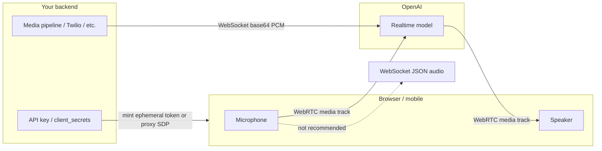
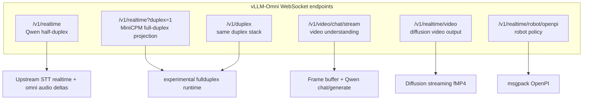

# Realtime APIs: OpenAI vs vLLM-Omni

This guide explains how [OpenAI Realtime](https://developers.openai.com/api/docs/guides/realtime) works (transports, session model, events, concrete usage), then maps that design onto the realtime-related surfaces in vLLM-Omni. Use it to choose the right endpoint and to understand what is compatible versus deliberately different.

!!! note "Scope"
    OpenAI details below follow the public GA guides (WebRTC, WebSocket, conversations). vLLM-Omni details follow the current tree: Qwen `/v1/realtime`, MiniCPM duplex (`?duplex=1`), `/v1/video/chat/stream`, and `/v1/realtime/video`. Adjacent robot/video path reuse of the `/v1/realtime*` prefix is called out so it is not confused with conversational Realtime.

## Quick map

| Goal | OpenAI | vLLM-Omni |
| --- | --- | --- |
| Browser speech-to-speech voice agent | WebRTC → `/v1/realtime` (+ Agents SDK recommended) | No WebRTC. Use WebSocket `/v1/realtime` (Qwen) or `/v1/realtime?duplex=1` (MiniCPM experimental) |
| Server-to-server audio pipeline | WebSocket `wss://api.openai.com/v1/realtime` | WebSocket to your omni server |
| Live speech translation | `/v1/realtime/translations` | Not available |
| Live transcription only | Realtime transcription session | Partial overlap via Qwen `transcription.*` events; not a dedicated product surface |
| Stream video frames into a VLM and ask questions | Not the Realtime voice API (use Responses / chat with images) | **`WS /v1/video/chat/stream`** |
| Stream generated video bytes (diffusion) | Videos REST / other APIs | **`WS /v1/realtime/video`** (name only; custom protocol) |

**Bottom line:** OpenAI Realtime is a multi-transport voice-agent platform (WebRTC + WebSocket + SIP) with server VAD, tools, and GA event names. vLLM-Omni exposes several WebSocket protocols that *look* related by URL or event names, but only a subset aims at OpenAI-shaped conversational Realtime—and none are a drop-in replacement for OpenAI WebRTC clients.

---

## Part 1 — OpenAI Realtime fundamentals

### What a Realtime session is

A Realtime session is a **stateful, long-lived connection** between client and model. The main objects are:

| Object | Role |
| --- | --- |
| **Session** | Configuration: model, voice, audio formats, turn detection, instructions, tools, modalities |
| **Conversation** | Ordered items (user/assistant/system messages, function calls, etc.) accumulated during the session |
| **Response** | One model turn: may emit text and/or audio items into the conversation |

Clients drive the session by sending **client events**; the service emits **server events**. Maximum session duration is on the order of **60 minutes** (per OpenAI docs).

OpenAI also splits product surfaces:

| Session type | When to use | Pattern |
| --- | --- | --- |
| Voice-agent | Assistant listens, reasons, speaks, calls tools | `/v1/realtime` conversation lifecycle |
| Translation | Continuous speech translation | `/v1/realtime/translations` (no normal `response.create` turn loop) |
| Transcription | Streaming transcript without spoken replies | Transcription-oriented Realtime session |

This document focuses on **voice-agent** sessions unless noted.

### Transport choices



| Transport | Best for | Audio path | Control path |
| --- | --- | --- | --- |
| **WebRTC** | Browser / mobile clients | PeerConnection media tracks (browser handles capture/playback/jitter) | Data channel `oai-events` (JSON events) |
| **WebSocket** | Server-to-server, telephony bridges, workers | Base64 audio inside JSON events on the same socket | Same socket, ordered JSON events |
| **SIP** | Phone voice agents | Telephony media | SIP + Realtime session controls |

**Why WebRTC for browsers:** uncertain networks, A/V device handling, and media reliability are what WebRTC is built for. On WebSocket you must chunk, encode, buffer, and play audio yourself.

**Auth rules of thumb:**

- Never put a long-lived OpenAI API key in browser code.
- Browser flows use **ephemeral client secrets** (`POST /v1/realtime/client_secrets`) or a **unified SDP proxy** (`POST /v1/realtime/calls` from your server).
- Trusted backends may connect WebSocket with `Authorization: Bearer $OPENAI_API_KEY`.
- Prefer sending `OpenAI-Safety-Identifier` (stable hashed user id) from your backend when minting tokens or opening sessions.

### WebRTC in detail

Two supported browser connection patterns:

#### A) Unified interface (server proxies SDP)

1. Browser creates `RTCPeerConnection`, adds mic track, creates data channel `oai-events`, creates SDP offer.
2. Browser POSTs offer SDP to **your** server.
3. Your server builds multipart form (`sdp` + `session` JSON) and POSTs to `https://api.openai.com/v1/realtime/calls` with the real API key.
4. OpenAI returns answer SDP; your server returns it to the browser; browser `setRemoteDescription`.

```javascript
// Browser (simplified)
const pc = new RTCPeerConnection();
const audioEl = document.createElement("audio");
audioEl.autoplay = true;
pc.ontrack = (e) => (audioEl.srcObject = e.streams[0]);

const ms = await navigator.mediaDevices.getUserMedia({ audio: true });
pc.addTrack(ms.getTracks()[0]);

const dc = pc.createDataChannel("oai-events");
dc.addEventListener("message", (e) => console.log(JSON.parse(e.data)));

const offer = await pc.createOffer();
await pc.setLocalDescription(offer);

const sdpAnswer = await fetch("/session", {
  method: "POST",
  body: offer.sdp,
  headers: { "Content-Type": "application/sdp" },
}).then((r) => r.text());

await pc.setRemoteDescription({ type: "answer", sdp: sdpAnswer });
```

Server side posts to OpenAI with `FormData` containing `sdp` and a `session` blob such as:

```json
{
  "type": "realtime",
  "model": "gpt-realtime-2.1",
  "audio": { "output": { "voice": "marin" } }
}
```

#### B) Ephemeral token (browser talks to OpenAI after mint)

1. Browser asks your `/token` endpoint.
2. Your server `POST /v1/realtime/client_secrets` with API key + session config; returns `value` (ephemeral key, often `ek_...`).
3. Browser creates PeerConnection as above, then POSTs SDP to `https://api.openai.com/v1/realtime/calls` with `Authorization: Bearer ek_...`.

**Events over WebRTC:**

- Mic/speaker audio: media tracks (no `input_audio_buffer.append` required for normal talk).
- Lifecycle / text / tools: JSON on the data channel.
- You still receive VAD lifecycle events such as `input_audio_buffer.speech_started` / `speech_stopped`.

### WebSocket in detail

Connect from a trusted server:

```text
wss://api.openai.com/v1/realtime?model=gpt-realtime-2.1
Authorization: Bearer $OPENAI_API_KEY
OpenAI-Safety-Identifier: hashed-user-id
```

Python sketch:

```python
import json, os, websocket

url = "wss://api.openai.com/v1/realtime?model=gpt-realtime-2.1"
headers = [
    "Authorization: Bearer " + os.environ["OPENAI_API_KEY"],
    "OpenAI-Safety-Identifier: hashed-user-id",
]

def on_open(ws):
    ws.send(json.dumps({
        "type": "session.update",
        "session": {
            "type": "realtime",
            "model": "gpt-realtime-2.1",
            "output_modalities": ["audio"],
            "audio": {
                "input": {
                    "format": {"type": "audio/pcm", "rate": 24000},
                    "turn_detection": {"type": "semantic_vad"},
                },
                "output": {
                    "format": {"type": "audio/pcm"},
                    "voice": "marin",
                },
            },
            "instructions": "Speak clearly and briefly.",
        },
    }))

def on_message(ws, message):
    print(json.loads(message))

websocket.WebSocketApp(url, header=headers, on_open=on_open, on_message=on_message).run_forever()
```

**Audio over WebSocket (manual):**

1. Capture PCM (commonly 24 kHz PCM16 for current guides).
2. Base64-encode chunks (≤ 15 MB each).
3. Send `input_audio_buffer.append`.
4. With VAD on: server commits turns and creates responses automatically.
5. With VAD off (`turn_detection: null`): client must `input_audio_buffer.commit` then `response.create` (and often `clear` before the next utterance).
6. Play `response.output_audio.delta` base64 chunks (GA name). Older beta docs used `response.audio.delta`.

### Session configuration (GA shape)

Important GA fields (illustrative):

```json
{
  "type": "session.update",
  "session": {
    "type": "realtime",
    "model": "gpt-realtime-2.1",
    "output_modalities": ["audio"],
    "audio": {
      "input": {
        "format": { "type": "audio/pcm", "rate": 24000 },
        "turn_detection": { "type": "semantic_vad" }
      },
      "output": {
        "format": { "type": "audio/pcm" },
        "voice": "marin"
      }
    },
    "instructions": "...",
    "tools": []
  }
}
```

Notes:

- `voice` cannot change after the model has produced audio in the session.
- Built-in voices include names such as `marin`, `cedar`, `alloy`, etc. (see current OpenAI voice list).
- Tools / function calling are first-class: model emits function-call items; client returns outputs via conversation item events.
- Image input is supported on realtime models via `conversation.item.create` with `input_image` content parts.
- Out-of-band responses (`response.conversation = "none"`) can classify or analyze without polluting the default conversation.

### Voice activity detection (VAD)

| Mode | Behavior |
| --- | --- |
| Default VAD / `semantic_vad` | Server detects speech start/stop; auto-commits and often auto-creates responses |
| Keep VAD, disable auto response | Set `turn_detection.create_response` / `interrupt_response` false; still get speech events; call `response.create` yourself |
| `turn_detection: null` | Push-to-talk style: client `commit` + `response.create` (+ `clear`) |

### Typical GA event flows

**Text turn**

1. Client: `conversation.item.create` (user `input_text`)
2. Client: `response.create`
3. Server: `response.created` → `response.output_item.added` → `response.output_text.delta`* → `response.output_text.done` → item/response done

**Audio turn (WebSocket + VAD)**

1. Client: many `input_audio_buffer.append`
2. Server: `speech_started` / `speech_stopped` / `committed`
3. Server: `response.created` → `response.output_audio.delta`* (+ transcript deltas) → `response.done`

**Manual audio turn (VAD off)**

1. `append`… → `input_audio_buffer.commit` → `response.create`
2. Same response lifecycle as above

!!! tip "Beta → GA naming"
    If you still see `response.audio.delta` in older samples, GA prefers `response.output_audio.delta`, `response.output_text.delta`, `response.output_audio_transcript.delta`. Also remove legacy `OpenAI-Beta: realtime=v1` headers when using GA.

### Concrete OpenAI usage checklist

1. Pick transport: WebRTC (client) vs WebSocket (server).
2. Mint credentials safely (`client_secrets` or server-side key).
3. `session.update` with model, audio formats, VAD, instructions, tools.
4. Stream audio (tracks or append events) and/or create text/image items.
5. Handle server events for UI (partial text, transcripts, tool calls).
6. Return tool results; cancel with `response.cancel` when needed.
7. Respect session limits and voice lock-in after first audio.

Official entry points:

- [Realtime overview](https://developers.openai.com/api/docs/guides/realtime)
- [WebRTC guide](https://developers.openai.com/api/docs/guides/realtime-webrtc)
- [WebSocket guide](https://developers.openai.com/api/docs/guides/realtime-websocket)
- [Conversations guide](https://developers.openai.com/api/docs/guides/realtime-conversations)

---

## Part 2 — vLLM-Omni realtime-related surfaces

vLLM-Omni does **not** implement OpenAI WebRTC or SIP. Conversational and media streaming all use **WebSocket**, with different protocols behind similar-looking paths.



### Endpoint comparison matrix

| Endpoint | Purpose | OpenAI-shaped? | Input | Output |
| --- | --- | --- | --- | --- |
| `/v1/realtime` | Qwen3-Omni half-duplex voice | Thin subset (older event names) | PCM audio append/commit | `transcription.*`, `response.audio.*` |
| `/v1/realtime?duplex=1` or `/v1/duplex` | MiniCPM-o native duplex | Rich projection + omni extensions | Continuous PCM (no client VAD) | `response.audio.*`, `response.speak` / `listen`, playback ACK, resume |
| `/v1/video/chat/stream` | Stream frames → ask questions | Custom `video.*` protocol | JPEG/PNG frames + optional PCM | Text / WAV audio deltas |
| `/v1/realtime/video` | Stream generated video | Custom `session.start` protocol | Text prompt | Binary fMP4 (`m4s`) |
| `/v1/realtime/robot/openpi` | Robot policy | Unrelated | OpenPI messages | Policy actions |

Design notes for duplex live in [`vllm_omni/experimental/fullduplex/DESIGN.md`](../../vllm_omni/experimental/fullduplex/DESIGN.md). Video chat details: [Streaming Video Input API](video_stream_api.md).

---

## Part 3 — Side-by-side: conversational Realtime

### Transport and auth

| Topic | OpenAI | vLLM-Omni |
| --- | --- | --- |
| WebRTC | First-class for clients | Not implemented |
| WebSocket | First-class for servers | Only conversational transport |
| SIP | Supported for telephony | Not implemented |
| Ephemeral client secrets | `POST /v1/realtime/client_secrets` | Not implemented |
| Browser auth pattern | ek_ token or SDP proxy | Typically open/local WS to your server (your reverse proxy owns auth) |

### Turn ownership

| Topic | OpenAI | Qwen `/v1/realtime` | MiniCPM duplex |
| --- | --- | --- | --- |
| Default turn taking | Server VAD / semantic VAD | Client commit → generation | **Model-owned** listen/speak at ~1s units |
| `turn_detection` | `server_vad` / `semantic_vad` / `null` | Upstream STT semantics | Must be **`null`** or error `unsupported_turn_detection` |
| Continuous mic while assistant speaks | Depends on VAD interrupt settings | Half-duplex oriented | Designed for continuous PCM every ~200 ms without commit |
| Hard barge-in | Supported via VAD interrupt | Limited | Capability `supports_barge_in=False`; soft interrupt via model policy |
| Playback acknowledgement | Not the same history-commit model | N/A | `playback.ack` advances history commit |

OpenAI with `turn_detection: null` means **client** decides when a turn ends. Omni duplex with `turn_detection: null` means **the model** decides listen vs speak. Same field value, opposite ownership.

### Event naming and lifecycle

| Concern | OpenAI GA | Omni Qwen path | Omni duplex path |
| --- | --- | --- | --- |
| Audio delta | `response.output_audio.delta` | `response.audio.delta` | `response.audio.delta` |
| Transcript delta | `response.output_audio_transcript.delta` | Often via `transcription.*` | `response.audio_transcript.delta` (paired with audio) |
| Session config shape | Nested `session.audio.input/output` | Flatter / upstream STT style | OpenAI-ish + omni fields (`ref_audio`, etc.) |
| Omni-only events | — | — | `response.speak`, `response.listen`, `overlap.decision`, resume/replace/resync |
| Tools | First-class | Not the focus | Stored/echoed; native path rejects tool overrides |
| Image in Realtime session | Supported | No | No (DESIGN: video input not claimed) |
| Rate limits event | Real quotas | Minimal | Emits empty `rate_limits.updated` for compatibility |

### Architecture mental models

**OpenAI**

```text
Client audio → (WebRTC track | WS append) → Server VAD / policy
  → Model response → (media track | output_audio.delta) → Client
```

**Omni duplex**

```text
Client continuous PCM append
  → DuplexSession / control plane / Stage0 KV-continuous units
  → model listen|speak decision
  → Realtime projector → WS events
  → Client playback.ack → history commit
```

Realtime IDs on the duplex path are **projection caches**; domain decisions live in `DuplexSession` + engine fences (see DESIGN.md).

---

## Part 4 — Concrete vLLM-Omni usage

### A) Qwen3-Omni half-duplex `/v1/realtime`

Start server (realtime needs async-chunk disabled for this path):

```bash
vllm serve Qwen/Qwen3-Omni-30B-A3B-Instruct \
  --deploy-config vllm_omni/deploy/qwen3_omni.yaml \
  --omni \
  --no-async-chunk \
  --port 8091 \
  --trust-remote-code
```

Example client:

```bash
python examples/online_serving/qwen3_omni/openai_realtime_client.py \
  --url ws://localhost:8091/v1/realtime \
  --model Qwen/Qwen3-Omni-30B-A3B-Instruct \
  --input-wav input_16k_mono.wav \
  --output-wav realtime_output.wav
```

Typical client events: `session.update`, `input_audio_buffer.append`, `input_audio_buffer.commit`.  
Typical server events: `transcription.delta` / `done`, `response.audio.delta` / `done`.

Expect **16 kHz mono PCM16** input in the sample client; output audio is commonly ~24 kHz.

### B) MiniCPM-o full-duplex `/v1/realtime?duplex=1`

Requires a duplex-enabled deploy (`session_mode: duplex`) and client query `duplex=1` (and model activation flags such as `extra_body.minicpmo45_native_duplex=true` / demo query params). See `examples/online_serving/minicpmo/` and `vllm_omni/experimental/fullduplex/`.

Browser path intent:

1. `session.update` with `turn_detection: null`, audio formats, voice/ref audio as required.
2. Stream `input_audio_buffer.append` continuously (~200 ms), including during assistant playback.
3. Do **not** rely on browser VAD commits.
4. Consume `response.speak` / audio+transcript deltas / `response.listen`.
5. Send `playback.ack` so history can commit played audio.
6. Optional: resume/takeover via session resume APIs exposed by the duplex attachment registry.

This is the closest Omni surface to “OpenAI Realtime-shaped events”, but it is still an **experimental projection**, not GA OpenAI parity.

### C) Video understanding `/v1/video/chat/stream`

Not Realtime voice. Protocol is custom:

```text
session.config
→ video.frame* (+ audio.chunk*)
→ video.query
→ response.text.* / response.audio.*
→ video.done → session.done
```

```bash
vllm serve Qwen/Qwen3-Omni-30B-A3B-Instruct \
  --deploy-config vllm_omni/deploy/qwen3_omni.yaml \
  --omni --port 8000 --trust-remote-code

python examples/online_serving/qwen3_omni/streaming_video_client.py \
  --host 127.0.0.1 --port 8000 \
  --video /path/to/video.mp4 \
  --query "Describe what is happening in the video."
```

Details: [Streaming Video Input API](video_stream_api.md).

Important limits: ring-buffer of JPEG/PNG frames + EVS filter; each `video.query` rebuilds the multimodal prompt (**no session KV reuse**); Qwen handler uses **manual** query trigger (not auto-VAD turns).

### D) Generated video stream `/v1/realtime/video`

Also not conversational Realtime. Diffusion text-to-video chunk streaming:

```bash
vllm serve BestWishYsh/Helios-Distilled \
  --omni --diffusion-streaming-output --port 8000

python examples/online_serving/streaming_video_generation/streaming_video_client.py \
  --host 127.0.0.1 --port 8000 \
  --model BestWishYsh/Helios-Distilled \
  --prompt "A serene lakeside sunrise with mist over the water." \
  --output helios_stream.mp4
```

Protocol: `session.start` → `video.start` → binary `m4s` frames → `session.done`. See `examples/online_serving/streaming_video_generation/README.md`.

---

## Part 5 — Compatibility expectations

### What works if you point an OpenAI sample at Omni

| Client expectation | Likely result on Omni |
| --- | --- |
| Minimal WS append/commit + listen for audio deltas (old beta names) | May work against Qwen `/v1/realtime` or duplex with careful config |
| GA event names (`response.output_audio.delta`) | Will not match Omni emitters today |
| WebRTC / Agents SDK Voice | Will not connect (no SDP/WebRTC stack) |
| `semantic_vad` / server VAD auto turns | Duplex rejects non-null `turn_detection` |
| Tools + image in the same Realtime session | Not supported on Omni Realtime paths |
| Drop-in replacement for `api.openai.com` | **No** |

### Recommended positioning

| If you need… | Prefer |
| --- | --- |
| Production OpenAI voice agents in browsers | OpenAI WebRTC + Voice Agents SDK |
| Self-hosted Qwen speech round-trips | Omni `/v1/realtime` + sample client |
| Experimental continuous duplex with model-owned turns | Omni `/v1/realtime?duplex=1` (MiniCPM), read DESIGN.md |
| Streaming video Q&A | Omni `/v1/video/chat/stream` |
| Streaming diffusion video bytes | Omni `/v1/realtime/video` |

### Gap list if Omni were to chase OpenAI GA parity

1. WebRTC + ephemeral credentials (or documented SDP proxy pattern)
2. GA event + session schema (`response.output_*`, nested `session.audio.*`)
3. Optional server/semantic VAD in addition to model-owned duplex policy
4. Tools / function calling execution on the realtime path
5. Image (and true AV-sync video) in conversational realtime sessions
6. Dedicated transcription / translation session types
7. Unify Qwen thin path vs MiniCPM duplex so one `/v1/realtime` contract is documented end-to-end

---

## Part 6 — Cheat sheets

### OpenAI WebSocket audio (VAD on)

```text
connect wss://api.openai.com/v1/realtime?model=...
→ session.update (semantic_vad, formats, voice)
→ input_audio_buffer.append*
← speech_started / speech_stopped / committed
← response.created / output_audio.delta* / response.done
```

### OpenAI WebRTC audio

```text
getUserMedia → RTCPeerConnection tracks
→ createDataChannel("oai-events")
→ SDP exchange via /v1/realtime/calls (unified or ephemeral)
← media audio plays via ontrack
↔ JSON events on data channel for session/tools/text
```

### Omni Qwen realtime

```text
ws://host/v1/realtime
→ session.update
→ input_audio_buffer.append* → commit
← transcription.* / response.audio.delta*
```

### Omni MiniCPM duplex

```text
ws://host/v1/realtime?duplex=1
→ session.update (turn_detection=null, ...)
→ input_audio_buffer.append every ~200ms (no commit)
← response.speak / audio+transcript deltas / response.listen
→ playback.ack
```

### Omni video chat

```text
ws://host/v1/video/chat/stream
→ session.config
→ video.frame* / audio.chunk*
→ video.query
← response.text.* / response.audio.*
→ video.done
```

### Omni video generation stream

```text
ws://host/v1/realtime/video
→ session.start {prompt, format:m4s, ...}
← video.start
← binary m4s chunks
← session.done
```

---

## References in this repo

| Path | Role |
| --- | --- |
| `docs/serving/video_stream_api.md` | `/v1/video/chat/stream` reference |
| `examples/online_serving/qwen3_omni/openai_realtime_client.py` | Qwen realtime client |
| `examples/online_serving/qwen3_omni/streaming_video_client.py` | Video chat client |
| `examples/online_serving/streaming_video_generation/` | `/v1/realtime/video` demos |
| `examples/online_serving/minicpmo/` | Duplex realtime demos |
| `vllm_omni/experimental/fullduplex/DESIGN.md` | Duplex architecture + normative event contract |
| `vllm_omni/entrypoints/openai/api_server.py` | Route registration for all WS endpoints |
| `vllm_omni/entrypoints/openai/realtime_connection.py` | Qwen omni realtime audio deltas |
| `vllm_omni/entrypoints/openai/serving_video_output_stream.py` | Generated video WS handler |
| `vllm_omni/entrypoints/openai/serving_video_stream.py` | Video chat WS handler |
