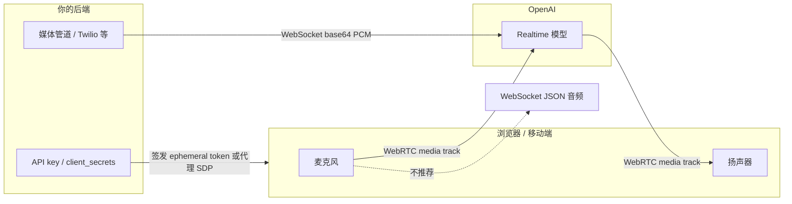
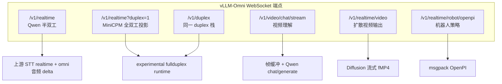

# Realtime API 对比：OpenAI 与 vLLM-Omni

> 英文版：[Realtime APIs: OpenAI vs vLLM-Omni](realtime_api_comparison.md)

本文说明 [OpenAI Realtime](https://developers.openai.com/api/docs/guides/realtime) 的基础原理（传输层、会话模型、事件、具体用法），再对照映射到 vLLM-Omni 中与 realtime 相关的接口。用于选型正确端点，并区分「兼容」与「刻意不同」。

!!! note "范围说明"
    OpenAI 部分依据公开 GA 文档（WebRTC、WebSocket、conversations）。vLLM-Omni 部分依据当前代码树：Qwen `/v1/realtime`、MiniCPM duplex（`?duplex=1`）、`/v1/video/chat/stream`、`/v1/realtime/video`。同前缀下的 robot/video 路径会单独标出，避免与对话式 Realtime 混淆。

## 速查表

| 目标 | OpenAI | vLLM-Omni |
| --- | --- | --- |
| 浏览器端语音 Agent（speech-to-speech） | WebRTC → `/v1/realtime`（推荐 Agents SDK） | 无 WebRTC。用 WebSocket `/v1/realtime`（Qwen）或 `/v1/realtime?duplex=1`（MiniCPM 实验） |
| 服务端到服务端音频管道 | WebSocket `wss://api.openai.com/v1/realtime` | 连到自建 omni 服务的 WebSocket |
| 实时语音翻译 | `/v1/realtime/translations` | 无 |
| 仅实时转写 | Realtime transcription session | Qwen 有部分 `transcription.*` 重叠；非独立产品面 |
| 视频帧流式输入 + 提问 | 不是 Realtime 语音 API（用 Responses / 带图 chat） | **`WS /v1/video/chat/stream`** |
| 流式接收生成视频字节（扩散） | Videos REST 等 | **`WS /v1/realtime/video`**（仅路径名相关；自定义协议） |

**一句话结论：** OpenAI Realtime 是多传输语音 Agent 平台（WebRTC + WebSocket + SIP），带服务端 VAD、工具与 GA 事件名。vLLM-Omni 暴露多条「路径或事件名看起来相关」的 WebSocket 协议，其中仅一部分朝 OpenAI 形对话 Realtime 投影，**没有任何一条是 OpenAI WebRTC 客户端的 drop-in 替代**。

---

## 第一部分 — OpenAI Realtime 基础原理

### Realtime 会话是什么

Realtime 会话是客户端与模型之间的**有状态长连接**。核心对象：

| 对象 | 作用 |
| --- | --- |
| **Session** | 配置：模型、音色、音频格式、turn detection、instructions、tools、模态 |
| **Conversation** | 会话中累积的有序 items（user/assistant/system、function call 等） |
| **Response** | 一次模型回合：可能产出文本和/或音频 item 写入 Conversation |

客户端通过发送 **client events** 驱动会话；服务端发出 **server events**。文档中的会话最长约 **60 分钟**。

OpenAI 还拆分了产品面：

| 会话类型 | 适用场景 | 模式 |
| --- | --- | --- |
| Voice-agent | 助手听、推理、说、调工具 | `/v1/realtime` 对话生命周期 |
| Translation | 连续语音翻译 | `/v1/realtime/translations`（不是常规 `response.create` 回合循环） |
| Transcription | 只要流式转写、不要口播回复 | 以转写为中心的 Realtime 会话 |

下文除非特别说明，均指 **voice-agent**。

### 传输层选型



| 传输 | 最适合 | 音频路径 | 控制路径 |
| --- | --- | --- | --- |
| **WebRTC** | 浏览器 / 移动端客户端 | PeerConnection media tracks（浏览器负责采集/播放/抖动缓冲） | Data channel `oai-events`（JSON 事件） |
| **WebSocket** | 服务端到服务端、电话桥、worker | 同一 socket 上 JSON 事件内的 Base64 音频 | 同一 socket、有序 JSON 事件 |
| **SIP** | 电话语音 Agent | 电信媒体 | SIP + Realtime 会话控制 |

**浏览器为何优先 WebRTC：** 弱网、音视频设备管理、媒体可靠性正是 WebRTC 的设计目标。用 WebSocket 时，分片、编码、缓冲、播放都要自己做。

**鉴权经验法则：**

- 切勿把长期有效的 OpenAI API key 放进浏览器。
- 浏览器流程使用 **ephemeral client secrets**（`POST /v1/realtime/client_secrets`）或 **统一 SDP 代理**（由你的服务端 `POST /v1/realtime/calls`）。
- 可信后端可用 `Authorization: Bearer $OPENAI_API_KEY` 直连 WebSocket。
- 签发 token / 建会话时，建议由后端带上 `OpenAI-Safety-Identifier`（稳定、隐私友好的哈希用户 ID）。

### WebRTC 细节

浏览器侧有两种连接方式：

#### A) 统一接口（服务端代理 SDP）

1. 浏览器创建 `RTCPeerConnection`，加入麦克风 track，创建 data channel `oai-events`，生成 SDP offer。
2. 浏览器把 offer SDP POST 到**你自己的**服务端。
3. 你的服务端组 multipart form（`sdp` + `session` JSON），用真实 API key POST 到 `https://api.openai.com/v1/realtime/calls`。
4. OpenAI 返回 answer SDP；服务端回给浏览器；浏览器 `setRemoteDescription`。

```javascript
// 浏览器侧（简化）
const pc = new RTCPeerConnection();
const audioEl = document.createElement("audio");
audioEl.autoplay = true;
pc.ontrack = (e) => (audioEl.srcObject = e.streams[0]);

const ms = await navigator.mediaDevices.getUserMedia({ audio: true });
pc.addTrack(ms.getTracks()[0]);

const dc = pc.createDataChannel("oai-events");
dc.addEventListener("message", (e) => console.log(JSON.parse(e.data)));

const offer = await pc.createOffer();
await pc.setLocalDescription(offer);

const sdpAnswer = await fetch("/session", {
  method: "POST",
  body: offer.sdp,
  headers: { "Content-Type": "application/sdp" },
}).then((r) => r.text());

await pc.setRemoteDescription({ type: "answer", sdp: sdpAnswer });
```

服务端向 OpenAI 提交的 `session` 示例：

```json
{
  "type": "realtime",
  "model": "gpt-realtime-2.1",
  "audio": { "output": { "voice": "marin" } }
}
```

#### B) Ephemeral token（浏览器持短时密钥直连 OpenAI）

1. 浏览器请求你的 `/token`。
2. 服务端用 API key `POST /v1/realtime/client_secrets`，返回 `value`（常为 `ek_...`）。
3. 浏览器按上文建 PeerConnection，再以 `Authorization: Bearer ek_...` 把 SDP POST 到 `https://api.openai.com/v1/realtime/calls`。

**WebRTC 上的事件分工：**

- 麦克风/扬声器音频：media tracks（正常说话不必发 `input_audio_buffer.append`）。
- 生命周期 / 文本 / 工具：data channel 上的 JSON。
- 仍会收到 VAD 生命周期事件，如 `input_audio_buffer.speech_started` / `speech_stopped`。

### WebSocket 细节

从可信服务端连接：

```text
wss://api.openai.com/v1/realtime?model=gpt-realtime-2.1
Authorization: Bearer $OPENAI_API_KEY
OpenAI-Safety-Identifier: hashed-user-id
```

Python 示意：

```python
import json, os, websocket

url = "wss://api.openai.com/v1/realtime?model=gpt-realtime-2.1"
headers = [
    "Authorization: Bearer " + os.environ["OPENAI_API_KEY"],
    "OpenAI-Safety-Identifier: hashed-user-id",
]

def on_open(ws):
    ws.send(json.dumps({
        "type": "session.update",
        "session": {
            "type": "realtime",
            "model": "gpt-realtime-2.1",
            "output_modalities": ["audio"],
            "audio": {
                "input": {
                    "format": {"type": "audio/pcm", "rate": 24000},
                    "turn_detection": {"type": "semantic_vad"},
                },
                "output": {
                    "format": {"type": "audio/pcm"},
                    "voice": "marin",
                },
            },
            "instructions": "Speak clearly and briefly.",
        },
    }))

def on_message(ws, message):
    print(json.loads(message))

websocket.WebSocketApp(url, header=headers, on_open=on_open, on_message=on_message).run_forever()
```

**WebSocket 音频（需手动处理）：**

1. 采集 PCM（当前文档常见 24 kHz PCM16）。
2. Base64 编码分片（单片 ≤ 15 MB）。
3. 发送 `input_audio_buffer.append`。
4. 开启 VAD：服务端自动 commit，并通常自动创建 response。
5. 关闭 VAD（`turn_detection: null`）：客户端必须 `input_audio_buffer.commit` 再 `response.create`（下一轮前常需 `clear`）。
6. 播放 `response.output_audio.delta`（GA 名称）中的 Base64 分片。旧 Beta 文档使用 `response.audio.delta`。

### 会话配置（GA 形态）

重要字段示意：

```json
{
  "type": "session.update",
  "session": {
    "type": "realtime",
    "model": "gpt-realtime-2.1",
    "output_modalities": ["audio"],
    "audio": {
      "input": {
        "format": { "type": "audio/pcm", "rate": 24000 },
        "turn_detection": { "type": "semantic_vad" }
      },
      "output": {
        "format": { "type": "audio/pcm" },
        "voice": "marin"
      }
    },
    "instructions": "...",
    "tools": []
  }
}
```

注意：

- 会话中模型一旦产出过音频，`voice` 不可再改。
- 内置音色包括 `marin`、`cedar`、`alloy` 等（以 OpenAI 当前列表为准）。
- Tools / function calling 为一等能力：模型发出 function-call item，客户端通过 conversation item 事件回传结果。
- Realtime 模型支持图像输入：`conversation.item.create` 中使用 `input_image` content part。
- Out-of-band response（`response.conversation = "none"`）可做分类/分析，而不污染默认 conversation。

### 语音活动检测（VAD）

| 模式 | 行为 |
| --- | --- |
| 默认 VAD / `semantic_vad` | 服务端检测起止；自动 commit，并常自动创建 response |
| 保留 VAD，关闭自动回复 | 将 `turn_detection.create_response` / `interrupt_response` 设为 false；仍收语音事件；自行 `response.create` |
| `turn_detection: null` | 对讲机模式：客户端 `commit` + `response.create`（+ `clear`） |

### 典型 GA 事件流

**文本回合**

1. 客户端：`conversation.item.create`（user `input_text`）
2. 客户端：`response.create`
3. 服务端：`response.created` → `response.output_item.added` → `response.output_text.delta`* → `response.output_text.done` → item/response done

**音频回合（WebSocket + VAD）**

1. 客户端：多次 `input_audio_buffer.append`
2. 服务端：`speech_started` / `speech_stopped` / `committed`
3. 服务端：`response.created` → `response.output_audio.delta`*（+ transcript deltas）→ `response.done`

**手动音频回合（关闭 VAD）**

1. `append`… → `input_audio_buffer.commit` → `response.create`
2. 后续与上相同的 response 生命周期

!!! tip "Beta → GA 命名"
    若仍看到旧样例中的 `response.audio.delta`，GA 优先使用 `response.output_audio.delta`、`response.output_text.delta`、`response.output_audio_transcript.delta`。使用 GA 时请去掉遗留的 `OpenAI-Beta: realtime=v1` 头。

### OpenAI 实操清单

1. 选传输：WebRTC（客户端）或 WebSocket（服务端）。
2. 安全签发凭证（`client_secrets` 或服务端 API key）。
3. `session.update`：模型、音频格式、VAD、instructions、tools。
4. 推送音频（tracks 或 append）和/或创建文本/图像 item。
5. 处理服务端事件驱动 UI（部分文本、转写、tool call）。
6. 回传 tool 结果；需要时用 `response.cancel`。
7. 遵守会话时长与首段音频后的 voice 锁定。

官方入口：

- [Realtime overview](https://developers.openai.com/api/docs/guides/realtime)
- [WebRTC guide](https://developers.openai.com/api/docs/guides/realtime-webrtc)
- [WebSocket guide](https://developers.openai.com/api/docs/guides/realtime-websocket)
- [Conversations guide](https://developers.openai.com/api/docs/guides/realtime-conversations)

---

## 第二部分 — vLLM-Omni 的 realtime 相关面

vLLM-Omni **未实现** OpenAI WebRTC 或 SIP。对话与媒体流均走 **WebSocket**，相似路径背后是不同协议。



### 端点对照矩阵

| 端点 | 用途 | 是否 OpenAI 形 | 输入 | 输出 |
| --- | --- | --- | --- | --- |
| `/v1/realtime` | Qwen3-Omni 半双工语音 | 薄子集（偏旧事件名） | PCM append/commit | `transcription.*`、`response.audio.*` |
| `/v1/realtime?duplex=1` 或 `/v1/duplex` | MiniCPM-o 原生全双工 | 丰富投影 + omni 扩展 | 连续 PCM（无客户端 VAD） | `response.audio.*`、`response.speak`/`listen`、playback ACK、resume |
| `/v1/video/chat/stream` | 推帧后提问 | 自定义 `video.*` | JPEG/PNG 帧 + 可选 PCM | 文本 / WAV 音频 delta |
| `/v1/realtime/video` | 流式生成视频 | 自定义 `session.start` | 文本 prompt | 二进制 fMP4（`m4s`） |
| `/v1/realtime/robot/openpi` | 机器人策略 | 无关 | OpenPI 消息 | 策略动作 |

Duplex 设计见 [`vllm_omni/experimental/fullduplex/DESIGN.md`](../../vllm_omni/experimental/fullduplex/DESIGN.md)。视频理解细节见 [Streaming Video Input API](video_stream_api.md)。

---

## 第三部分 — 对话式 Realtime 逐项对比

### 传输与鉴权

| 主题 | OpenAI | vLLM-Omni |
| --- | --- | --- |
| WebRTC | 客户端一等公民 | 未实现 |
| WebSocket | 服务端一等公民 | 对话路径唯一传输 |
| SIP | 电话场景支持 | 未实现 |
| Ephemeral client secrets | `POST /v1/realtime/client_secrets` | 未实现 |
| 浏览器鉴权 | ek_ token 或 SDP 代理 | 通常直连本地/自建 WS（鉴权由你的反代负责） |

### Turn 所有权

| 主题 | OpenAI | Qwen `/v1/realtime` | MiniCPM duplex |
| --- | --- | --- | --- |
| 默认轮次 | 服务端 VAD / semantic VAD | 客户端 commit → 生成 | **模型拥有** listen/speak（约 1s 单元） |
| `turn_detection` | `server_vad` / `semantic_vad` / `null` | 上游 STT 语义 | 必须为 **`null`**，否则 `unsupported_turn_detection` |
| 助手说话时持续开麦 | 取决于 VAD interrupt 配置 | 偏半双工 | 设计为约每 200ms 连续 append、无需 commit |
| 硬 barge-in | VAD interrupt 支持 | 有限 | `supports_barge_in=False`；靠模型策略软打断 |
| 播放确认 | 非同一套 history-commit 模型 | 无 | `playback.ack` 推进历史提交 |

OpenAI 的 `turn_detection: null` 表示**客户端**决定回合结束；Omni duplex 的 `turn_detection: null` 表示**模型**决定听还是说。字段相同，所有权相反。

### 事件命名与生命周期

| 关注点 | OpenAI GA | Omni Qwen 路径 | Omni duplex 路径 |
| --- | --- | --- | --- |
| 音频 delta | `response.output_audio.delta` | `response.audio.delta` | `response.audio.delta` |
| 转写 delta | `response.output_audio_transcript.delta` | 常走 `transcription.*` | `response.audio_transcript.delta`（与音频成对） |
| Session 配置形态 | 嵌套 `session.audio.input/output` | 更扁平 / 上游 STT 风格 | OpenAI-ish + omni 字段（如 `ref_audio`） |
| Omni 专有事件 | — | — | `response.speak`、`response.listen`、`overlap.decision`、resume/replace/resync |
| Tools | 一等公民 | 非重点 | 多存储/回显；native 路径拒绝 tool override |
| Realtime 会话内图像 | 支持 | 否 | 否（DESIGN：未宣称 video input） |
| Rate limits 事件 | 真实配额 | 极少 | 为兼容发出空的 `rate_limits.updated` |

### 架构心智模型

**OpenAI**

```text
客户端音频 → (WebRTC track | WS append) → 服务端 VAD / 策略
  → 模型回复 → (media track | output_audio.delta) → 客户端
```

**Omni duplex**

```text
客户端连续 PCM append
  → DuplexSession / control plane / Stage0 KV 连续单元
  → 模型 listen|speak 决策
  → Realtime projector → WS 事件
  → 客户端 playback.ack → history commit
```

Duplex 路径上的 Realtime ID 是**投影缓存**；领域决策在 `DuplexSession` + engine fence（见 DESIGN.md）。

---

## 第四部分 — vLLM-Omni 具体用法

### A) Qwen3-Omni 半双工 `/v1/realtime`

启动服务（该路径需要关闭 async-chunk）：

```bash
vllm serve Qwen/Qwen3-Omni-30B-A3B-Instruct \
  --deploy-config vllm_omni/deploy/qwen3_omni.yaml \
  --omni \
  --no-async-chunk \
  --port 8091 \
  --trust-remote-code
```

示例客户端：

```bash
python examples/online_serving/qwen3_omni/openai_realtime_client.py \
  --url ws://localhost:8091/v1/realtime \
  --model Qwen/Qwen3-Omni-30B-A3B-Instruct \
  --input-wav input_16k_mono.wav \
  --output-wav realtime_output.wav
```

常见客户端事件：`session.update`、`input_audio_buffer.append`、`input_audio_buffer.commit`。  
常见服务端事件：`transcription.delta`/`done`、`response.audio.delta`/`done`。

示例客户端期望输入 **16 kHz 单声道 PCM16**；输出音频常见约 24 kHz。

### B) MiniCPM-o 全双工 `/v1/realtime?duplex=1`

需要启用 duplex 的部署（`session_mode: duplex`），客户端查询参数 `duplex=1`，以及模型激活标志（如 `extra_body.minicpmo45_native_duplex=true` / demo query）。参见 `examples/online_serving/minicpmo/` 与 `vllm_omni/experimental/fullduplex/`。

浏览器路径意图：

1. `session.update`：`turn_detection: null`、音频格式、必要时 voice/ref_audio。
2. 持续 `input_audio_buffer.append`（约 200 ms），含助手播放期间。
3. **不要**依赖浏览器 VAD commit。
4. 消费 `response.speak` / 音频+转写 delta / `response.listen`。
5. 发送 `playback.ack`，以便提交已播放历史。
6. 可选：通过 duplex attachment registry 做 resume/takeover。

这是最接近「OpenAI Realtime 形事件」的 Omni 面，但仍是**实验性投影**，不是 GA 对等实现。

### C) 视频理解 `/v1/video/chat/stream`

不是 Realtime 语音。自定义协议：

```text
session.config
→ video.frame* (+ audio.chunk*)
→ video.query
→ response.text.* / response.audio.*
→ video.done → session.done
```

```bash
vllm serve Qwen/Qwen3-Omni-30B-A3B-Instruct \
  --deploy-config vllm_omni/deploy/qwen3_omni.yaml \
  --omni --port 8000 --trust-remote-code

python examples/online_serving/qwen3_omni/streaming_video_client.py \
  --host 127.0.0.1 --port 8000 \
  --video /path/to/video.mp4 \
  --query "Describe what is happening in the video."
```

细节：[Streaming Video Input API](video_stream_api.md)。

重要限制：JPEG/PNG 环形缓冲 + EVS 过滤；每次 `video.query` 重建多模态 prompt（**无 session KV 复用**）；Qwen handler 为**手动** query 触发（非自动 VAD 回合）。

### D) 生成视频流 `/v1/realtime/video`

同样不是对话 Realtime。扩散 text-to-video 分片流：

```bash
vllm serve BestWishYsh/Helios-Distilled \
  --omni --diffusion-streaming-output --port 8000

python examples/online_serving/streaming_video_generation/streaming_video_client.py \
  --host 127.0.0.1 --port 8000 \
  --model BestWishYsh/Helios-Distilled \
  --prompt "A serene lakeside sunrise with mist over the water." \
  --output helios_stream.mp4
```

协议：`session.start` → `video.start` → 二进制 `m4s` → `session.done`。见 `examples/online_serving/streaming_video_generation/README.md`。

---

## 第五部分 — 兼容性预期

### 把 OpenAI 样例指向 Omni 会怎样

| 客户端预期 | 在 Omni 上的可能结果 |
| --- | --- |
| 最小 WS append/commit + 听音频 delta（旧 Beta 名） | 仔细配置下可能打通 Qwen `/v1/realtime` 或 duplex |
| GA 事件名（`response.output_audio.delta`） | 当前不匹配 Omni 发射事件 |
| WebRTC / Agents SDK Voice | 连不上（无 SDP/WebRTC 栈） |
| `semantic_vad` / 服务端 VAD 自动回合 | Duplex 拒绝非 null 的 `turn_detection` |
| 同一 Realtime 会话内 Tools + 图像 | Omni Realtime 路径不支持 |
| 替代 `api.openai.com` drop-in | **否** |

### 推荐定位

| 如果你需要… | 优先选择 |
| --- | --- |
| 生产级浏览器 OpenAI 语音 Agent | OpenAI WebRTC + Voice Agents SDK |
| 自托管 Qwen 语音往返 | Omni `/v1/realtime` + 示例客户端 |
| 实验性连续全双工、模型拥有回合 | Omni `/v1/realtime?duplex=1`（MiniCPM），阅读 DESIGN.md |
| 流式视频问答 | Omni `/v1/video/chat/stream` |
| 流式扩散视频字节 | Omni `/v1/realtime/video` |

### 若要追赶 OpenAI GA 的缺口清单

1. WebRTC + ephemeral 凭证（或文档化 SDP 代理模式）
2. GA 事件与 session schema（`response.output_*`、嵌套 `session.audio.*`）
3. 在模型拥有 duplex 策略之外，可选服务端/semantic VAD
4. Realtime 路径上真正执行 tools / function calling
5. 对话 Realtime 中的图像（以及真 AV 同步视频）
6. 独立的 transcription / translation 会话类型
7. 统一 Qwen 薄路径与 MiniCPM duplex，形成端到端单一 `/v1/realtime` 契约

---

## 第六部分 — 速查 cheat sheet

### OpenAI WebSocket 音频（开 VAD）

```text
connect wss://api.openai.com/v1/realtime?model=...
→ session.update (semantic_vad, formats, voice)
→ input_audio_buffer.append*
← speech_started / speech_stopped / committed
← response.created / output_audio.delta* / response.done
```

### OpenAI WebRTC 音频

```text
getUserMedia → RTCPeerConnection tracks
→ createDataChannel("oai-events")
→ 经 /v1/realtime/calls 交换 SDP（统一接口或 ephemeral）
← ontrack 播放媒体音频
↔ data channel 上 JSON 事件（session/tools/text）
```

### Omni Qwen realtime

```text
ws://host/v1/realtime
→ session.update
→ input_audio_buffer.append* → commit
← transcription.* / response.audio.delta*
```

### Omni MiniCPM duplex

```text
ws://host/v1/realtime?duplex=1
→ session.update (turn_detection=null, ...)
→ 约每 200ms input_audio_buffer.append（无 commit）
← response.speak / 音频+转写 delta / response.listen
→ playback.ack
```

### Omni 视频理解

```text
ws://host/v1/video/chat/stream
→ session.config
→ video.frame* / audio.chunk*
→ video.query
← response.text.* / response.audio.*
→ video.done
```

### Omni 视频生成流

```text
ws://host/v1/realtime/video
→ session.start {prompt, format:m4s, ...}
← video.start
← 二进制 m4s 分片
← session.done
```

---

## 仓库内参考

| 路径 | 作用 |
| --- | --- |
| `docs/serving/realtime_api_comparison.md` | 本文英文版 |
| `docs/serving/video_stream_api.md` | `/v1/video/chat/stream` 参考 |
| `examples/online_serving/qwen3_omni/openai_realtime_client.py` | Qwen realtime 客户端 |
| `examples/online_serving/qwen3_omni/streaming_video_client.py` | 视频理解客户端 |
| `examples/online_serving/streaming_video_generation/` | `/v1/realtime/video` 示例 |
| `examples/online_serving/minicpmo/` | Duplex realtime 示例 |
| `vllm_omni/experimental/fullduplex/DESIGN.md` | Duplex 架构与规范事件契约 |
| `vllm_omni/entrypoints/openai/api_server.py` | 全部 WS 路由注册 |
| `vllm_omni/entrypoints/openai/realtime_connection.py` | Qwen omni realtime 音频 delta |
| `vllm_omni/entrypoints/openai/serving_video_output_stream.py` | 生成视频 WS handler |
| `vllm_omni/entrypoints/openai/serving_video_stream.py` | 视频理解 WS handler |
